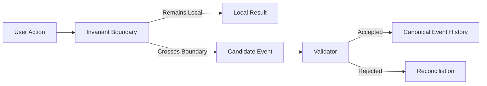

# CrypSA Architecture Overview

This document provides a high-level map of how CrypSA is structured.

It focuses on system structure rather than step-by-step flow.

For a worked example, see:

* `CrypSA_Worked_Example.md`

---

## 📜 Authority Level

CrypSA documentation is structured across layers:

* `/spec` — authoritative definition of runtime behavior
* `/architecture` — system structure and conceptual models

This document provides a high-level structural overview.

For strict separation of responsibilities, see:

→ `CrypSA_Boundary_Definitions.md`

If there is any conflict:

* spec takes precedence over architecture

---

## High-Level View

CrypSA is structured around four core responsibilities:

* **Truth** — canonical event history and validation
* **Translation** — adapters shaping data
* **Interpretation** — lenses defining meaning
* **Experience** — UI and local interaction

These responsibilities are implemented across:

* observers
* the validator
* adapter layer
* lens layer
* UI / experience layer

---

## Core Components

---

### Observers

Observers:

* simulate the world locally
* generate candidate events
* maintain local prediction
* reconcile with canonical updates

They are responsible for local simulation and experience.

Observers do **not define truth**.

For the boundary between observers and the validator, see:

→ `CrypSA_Boundary_Definitions.md`

---

### Validator

The validator:

* receives candidate events
* validates them against invariants
* accepts or rejects them
* assigns canonical ordering (`canonical_sequence`)

If accepted, an event becomes canonical and is appended to canonical event history.

> Canonical event history is the source of truth.

The validator is a **logical role**, not a specific machine.

It is the only component that defines what becomes canonical.

It may run:

* locally (within an observer environment)
* remotely (as a dedicated server)

Its responsibilities do not change based on deployment.

---

### Server (Deployment Term)

A server is a deployment of a validator that runs remotely.

It is an infrastructure term, not an authority role.

Not all validators are servers, but all servers host a validator.

---

### Adapter Layer

Adapters:

* reshape canonical data and observer-local data
* prepare structured outputs for interpretation and UI

Adapters are the **translation layer**.

They reshape data for downstream systems.

For strict responsibility boundaries between adapters and lenses, see:

→ `CrypSA_Boundary_Definitions.md`

---

### Lens Layer

Lenses:

* interpret adapted data
* define meaning for an observer
* determine how data is understood in context

Lenses are the **interpretation layer**.

They interpret data for observer experience.

For strict responsibility boundaries between lenses and adapters, see:

→ `CrypSA_Boundary_Definitions.md`

---

### UI / Observer Experience

The UI layer:

* renders the world
* handles input
* provides immediate feedback

This is the **experience layer**.

---

## Architectural Separation

CrypSA enforces strict separation of responsibilities:

| Responsibility | Layer                                |
| -------------- | ------------------------------------ |
| Truth          | Validation + canonical event history |
| Translation    | Adapters                             |
| Interpretation | Lenses                               |
| Experience     | UI / interaction                     |

This separation prevents:

* UI logic leaking into canonical truth
* validation becoming entangled with presentation
* interpretation being confused with data transformation

---

## Responsibility Boundaries

CrypSA enforces strict boundaries between system responsibilities.

These boundaries prevent:

* responsibility overlap
* architectural drift
* ambiguity in system design

For formal definitions of these boundaries, see:

→ `CrypSA_Boundary_Definitions.md`

---

## Why This Structure Exists

Traditional architectures often combine:

* simulation
* validation
* rendering

into tightly coupled systems.

CrypSA separates them to:

* improve clarity
* enable deterministic replay
* support multiple observer perspectives
* allow independent evolution of layers

For how this architecture affects infrastructure design, see:

→ `CrypSA_Infrastructure_Implications.md`

---

## Data Flow (Simplified)

---

## Intent Flow (Simplified)

---

## Important Distinction

CrypSA separates:

* **what is true**
  from
* **how it is interpreted and experienced**

Truth is established through validation and recorded in canonical event history.

Derived canonical state is reconstructed via replay.

Derived canonical state is not a source of truth.

> Derived canonical state is a projection of canonical event history.

Everything else builds on that.

---

## Summary

CrypSA is structured around a clear separation of responsibilities:

* the validator defines what becomes canonical
* canonical event history is the source of truth
* adapters transform data
* lenses interpret meaning
* observers simulate and reconcile
* UI presents the experience

This separation makes the system predictable, debuggable, and extensible.
