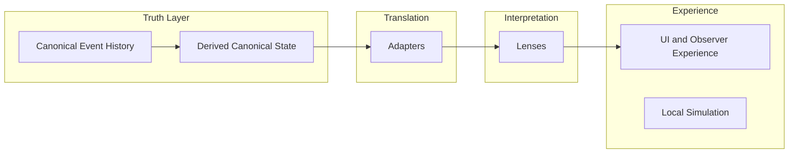

# CrypSA in 5 Minutes

This is a quick mental model for understanding CrypSA.

If you only read one document, read this.

---

## The Core Idea

CrypSA is a multiplayer architecture where:

> The shared world is defined by accepted events, not continuously synchronized state.

Instead of synchronizing everything all the time:

* clients simulate locally
* actions are proposed as events
* a validator validates those events
* accepted events are appended to canonical event history

A validator is the system responsible for accepting or rejecting candidate events and maintaining canonical truth.

Importantly:

> the validator is a role, not a location

It may run:

* **locally**, alongside an observer
* **remotely**, as a shared server for multiple observers

This matters because CrypSA is designed so that the truth model stays the same even when deployment changes.

That means a system can begin with a **local validator** for offline or resilient operation, and later move to a **remote validator** more easily without changing the core architectural model.

---

## 📊 Core Mental Model (Visual)

---

## The Mental Model

Think of CrypSA like this:

* the validator determines what becomes part of canonical event history
* observers simulate what they think is happening
* only validated actions become part of canonical event history
* everything else is local prediction

But the system becomes much clearer if you think of it as **four separate responsibilities**.

---

## The Four Responsibilities

CrypSA is easiest to understand as four layers:

---

### 1. Truth

This is the canonical layer.

It includes:

* canonical event history
* validation
* canonical ordering (`server_sequence`)
* derived canonical state via replay

This is the part of the system that defines what is real.

If something is not part of canonical event history:

> it did not happen

This is also where the validator belongs.

Whether the validator runs locally or remotely, its responsibility stays the same:

* accept or reject candidate events
* enforce invariants and rules
* determine what crosses into canonical truth

---

### 2. Translation

This is the adapter layer.

Adapters take canonical and observer-side data and reshape it into forms that other layers can consume safely.

They do things like:

* combine canonical and observer state
* normalize structures
* build view-ready or lens-ready data

Adapters do **not** define truth.

They answer:

> “How should this data be structured so it can be used?”

---

### 3. Interpretation

This is the lens layer.

Lenses interpret translated data into observer-specific meaning.

They may determine:

* what is visible
* what is interactable
* what matters to this observer
* what should appear in a teaching/debug view

Lenses do **not** define truth either.

They answer:

> “What does this mean for this observer?”

---

### 4. Experience

This is what the player directly interacts with.

It includes:

* UI
* rendering
* local feedback
* local simulation and prediction

This layer is:

* fast
* responsive
* immediate

But:

> nothing here is automatically part of canonical event history

---

## Local and Remote Validation

CrypSA does not require validation to be remote from the start.

A validator may run locally, remotely, or transition between those deployment styles over time.

This matters for two reasons.

### 1. Resilience

A local validator can help prevent immediate dropout or hard failure during network interruptions.

If validation exists locally, the system has a stronger foundation for:

* offline operation
* degraded connectivity
* local-first development
* more graceful interruption handling

### 2. Portability

If the system is designed from the start around a validator boundary instead of a permanently remote server, then it is easier to move between:

* offline/local validation
* host-based validation
* remote shared validation

In other words:

> CrypSA aims to keep the truth model stable even when the deployment model changes.

---

## What This Changes

Traditional multiplayer systems often combine too many responsibilities together:

* server simulates
* client displays
* state is synchronized constantly

CrypSA separates them more clearly:

* **truth is defined by canonical event history**
* **validation determines what becomes canonical**
* **translation is adapter-driven**
* **interpretation is lens-driven**
* **experience is local and responsive**

This also means that “server” should not always be thought of as “the thing somewhere else on the internet.”

In CrypSA, the more important concept is:

> the validator is the authority over canonical truth

A remote server is one possible deployment of that role.

---

## Why This Matters

This separation makes the system easier to:

* reason about
* debug
* persist
* replay
* evolve without collapsing boundaries

It also makes the architecture more flexible.

By treating validation as a role instead of a fixed machine location, CrypSA can better support:

* offline-first development
* migration from local to remote validation
* continuity during connection problems
* cleaner architectural scaling over time

The teaching prototype made this especially clear:

> truth, translation, interpretation, and experience work better when kept separate

---

## What CrypSA Is Not

CrypSA is not:

* a replacement for all multiplayer systems
* a solution for every type of game
* a way to eliminate latency

It is a different way of structuring:

* authority
* validation
* interpretation
* and shared reality derived from canonical event history

---

## Where It Fits

CrypSA works best when:

* actions are discrete
* history matters
* persistence matters

Examples:

* building systems
* crafting systems
* economic systems
* sandbox worlds

---

## Where It Fits Less Well

CrypSA is not ideal for:

* twitch shooters
* high-frequency combat
* physics-heavy PvP
