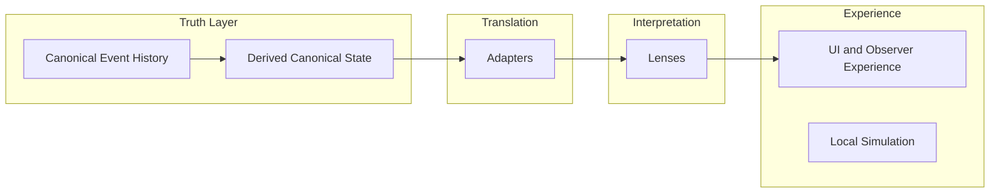

# CrypSA in 5 Minutes

This is a quick mental model for understanding CrypSA.

If you only read one document, read this.

---

Before reading this, you should have seen:
→ CrypSA_In_One_Diagram.md

This document explains the same system in words.

---

## The Core Idea

CrypSA is a multiplayer architecture where:

> The shared world is defined by accepted events, not continuously synchronized state.

Instead of synchronizing everything all the time:

* observers simulate locally
* actions are proposed as events
* a validator evaluates those events
* accepted events are appended to canonical event history

A validator is responsible for:

* accepting or rejecting candidate events
* maintaining canonical truth

Importantly:

> the validator is a role, not a location

It may run:

* **locally**, alongside an observer
* **remotely**, as a shared system for multiple observers

This means the truth model remains stable even when deployment changes.

A system can begin with a **local validator** and later move to a **remote validator** without changing its core architecture.

---

## 📊 Core Mental Model (Visual)

---

## The Mental Model

Think of CrypSA like this:

* the validator determines what becomes canonical
* observers simulate what they think is happening
* only validated actions become part of canonical event history
* everything else is local prediction

The system becomes clearer when viewed as **four separate responsibilities**.

---

## The Four Responsibilities

CrypSA is easiest to understand as four layers:

---

### 1. Truth

This is the canonical layer.

It includes:

* canonical event history
* validation
* canonical ordering (`canonical_sequence`)
* derived canonical state via replay

This layer defines what is real.

If something is not part of canonical event history:

> it did not happen

This is also where the validator belongs.

---

### 2. Translation

This is the adapter layer.

Adapters:

* reshape canonical and observer data
* prepare structured outputs for other layers

Adapters do **not** define truth.

They answer:

> “How should this data be structured?”

---

### 3. Interpretation

This is the lens layer.

Lenses:

* interpret translated data
* define meaning for an observer
* determine relevance and context

Lenses do **not** define truth.

They answer:

> “What does this mean for this observer?”

---

### 4. Experience

This is what the player directly interacts with.

It includes:

* UI
* rendering
* local feedback
* local simulation and prediction

This layer is:

* fast
* responsive
* immediate

But:

> nothing here becomes canonical automatically

---

## Local and Remote Validation

CrypSA does not require validation to be remote.

A validator may run locally, remotely, or transition between them.

### 1. Resilience

A local validator enables:

* offline operation
* degraded connectivity handling
* local-first development

---

### 2. Portability

Designing around a validator boundary allows easy transition between:

* local validation
* host-based validation
* remote validation

> The truth model remains stable even as deployment changes.

---

## What This Changes

Traditional systems often combine:

* simulation
* validation
* rendering

CrypSA separates them:

* **truth is defined by canonical event history**
* **validation determines what becomes canonical**
* **translation structures data**
* **interpretation defines meaning**
* **experience remains local and responsive**

The key idea is:

> the validator defines canonical truth

A server is only one possible deployment of that role.

---

## Why This Matters

This separation makes systems easier to:

* reason about
* debug
* persist
* replay
* evolve without breaking boundaries

It also enables:

* offline-first development
* migration between deployment models
* resilience during connectivity issues

---

## What CrypSA Is Not

CrypSA is not:

* a replacement for all multiplayer systems
* a solution for every type of game
* a way to eliminate latency

It is a different way of structuring:

* authority
* validation
* interpretation
* shared reality

---

## Where It Fits

CrypSA works best when:

* actions are discrete
* history matters
* persistence matters

Examples:

* building systems
* crafting systems
* economic systems
* sandbox worlds

---

## Where It Fits Less Well

CrypSA is not ideal for:

* twitch shooters
* high-frequency combat
* physics-heavy PvP

---

## Next Step

Continue to:

👉 `CrypSA_Terminology_Primer.md`
