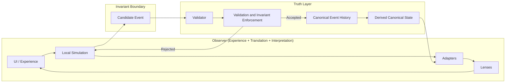

# CrypSA — In One Diagram

## Purpose

This diagram provides a complete, high-level view of the CrypSA architecture.

It shows how:

* observers simulate locally
* candidate events cross the invariant boundary
* the validator determines canonical truth
* canonical event history drives reconstruction

This is the **core mental model of CrypSA in a single view**.

---

## Diagram



---

## How to Read This

### Observer Loop (Left Side)

The observer continuously:

* renders experience (UI)
* simulates locally
* shapes data through adapters
* interprets meaning through lenses

This loop is:

* fast
* responsive
* non-authoritative

It is allowed to feel immediate even when canonical truth has not yet changed.

---

### Invariant Boundary (Center)

The key decision is:

> Does this action affect canonical event history?

If no:

* it remains local

If yes:

* it becomes a **candidate event**
* it must cross the invariant boundary
* it must be validated before becoming canonical

---

### Validator (Truth Authority)

The validator:

* evaluates candidate events
* enforces invariants
* accepts or rejects proposed canonical changes

It may run:

* **locally**, within the observer environment
* **remotely**, as a separate system

But:

> its role does not change

CrypSA defines the validator as an architectural role, not a fixed machine location.

---

### Canonical Truth (Right Side)

If accepted:

* the event is assigned canonical ordering (`canonical_sequence`)
* the event is appended to canonical event history

Canonical event history is:

> the only source of truth

Derived canonical state is useful, but it is reconstructed from canonical event history and is not independently authoritative.

---

### Reconstruction Loop

From canonical event history:

* derived canonical state is reconstructed
* observers receive canonical updates
* local state is corrected or confirmed

This ensures:

> all observers converge toward the same shared reality

---

## Key Insight

> CrypSA does not synchronize state.
> It synchronizes validated events.

And:

> validation determines what becomes real

---

## The Entire System in One Sentence

Observers simulate locally, propose candidate events across the invariant boundary, the validator determines which events become canonical, and canonical event history drives reconstruction of shared reality.

---

## Why This Matters

This model enables:

* local responsiveness
* deterministic reconstruction
* clear authority boundaries
* replayable systems
* flexible deployment (local or remote validator)
* persistent worlds defined by canonical history

---

## What Makes CrypSA Different

Traditional systems:

```text
Clients → Central Authority → State Synchronization
```

CrypSA:

```text
Observer → Validation → Canonical Event History → Reconstruction
```

---

## Related Reading

For deployment-specific clarification, see:

* `architecture/CrypSA_Validator_Deployment_Model.md`
* `diagrams/CrypSA_Local_vs_Remote_Validator.md`

---

## Summary

CrypSA separates:

* **Experience** → UI and local simulation
* **Translation** → adapters
* **Interpretation** → lenses
* **Truth** → validation and canonical event history

The invariant boundary and validator ensure that only valid events become part of shared reality.
