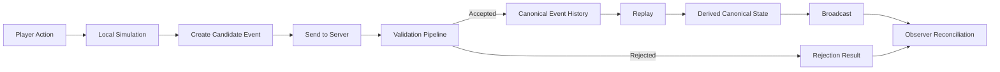

# CrypSA Worked Example

> Illustrative note: This document is illustrative.
>
> For authoritative behavior, see `spec/`.

This document walks through a complete runtime example of CrypSA.

It shows how:

* a local action becomes a candidate event
* the server validates that event
* canonical event history is updated
* observers reconcile their local state

This example focuses on clarity and uses a simple scenario.

---

## 📊 Runtime Flow Overview



---

## Scenario

A player places a mining station on an empty tile.

---

## Initial Canonical State

Derived canonical state (via replay):

* tile_42 → empty
* player_A → resources = 100

Observers have reconstructed this state locally.

---

## Phase 1 — Local Action (Observer)

The player performs:

> Place mining station on tile_42

The observer:

* applies a **local prediction**
* shows the structure immediately
* marks the action as **pending**

At this point:

* local state ≠ canonical state
* no shared change has occurred yet

---

## Phase 2 — Candidate Event Creation

The observer creates a candidate event:

```
event_type = place_structure
actor_id = player_A
target_ids = [tile_42]

payload = {
  structure_type: mining_station,
  cost: 50
}

precondition_refs = {
  tile_42_empty: true,
  player_resources >= 50
}

branch_id = main
event_id = evt_001
```

This event represents an **intent**, not a confirmed state change.

---

## Phase 3 — Submission

The observer sends the event to the canonical server.

State at this moment:

| Layer     | State                             |
| --------- | --------------------------------- |
| Local     | mining_station placed (predicted) |
| Canonical | tile_42 still empty               |

---

## Phase 4 — Validation Pipeline (Server)

The server processes the event.

### 4.1 Schema Validation

✅ pass

### 4.2 Identity Validation

✅ pass

### 4.3 Precondition Validation

✅ pass

### 4.4 Invariant Validation

✅ pass

### 4.5 Rule Validation

✅ pass

---

## Phase 5 — Acceptance

The server accepts the event.

Canonical metadata assigned:

```
canonical_event_id = canon_1203
server_sequence = 1203
accepted_at = timestamp
```

The event is appended to canonical event history.

---

## Phase 6 — Replay and Derived State

Replay applies the canonical event.

Derived canonical state updates:

* tile_42 → mining_station
* player_A resources → 50

Derived state now reflects the change.

---

## Phase 7 — Broadcast

The server sends the canonical event to all observers.

---

## Phase 8 — Observer Reconciliation

Each observer compares:

* local predicted state
* canonical update

---

### Case A — Prediction Matches

* no visible change
* pending marker cleared

---

### Case B — Prediction Differs

* local state is corrected
* invalid objects removed
* canonical state applied

---

### Adapter and Lens Interpretation

After reconciliation:

* canonical and observer state are shaped through adapters
* adapters produce structured data
* lenses interpret that data
* UI renders the result

```text
Canonical Update → Adapter → Lens → UI
```

---

## Alternative Scenario — Conflict

Two players attempt to place on tile_42.

### Server Behavior

* validates both
* accepts first valid event
* rejects second

### Rejection Result

```
result = rejected
reason = precondition_failed
```

### Observer Reconciliation

Rejected client:

* removes predicted structure
* updates to canonical state

---

## What This Demonstrates

* actions are proposals, not guarantees
* validation determines reality
* canonical event history is the source of truth
* observers may temporarily diverge
* reconciliation restores consistency

---

## Relationship to Specs

This example corresponds directly to:

* Runtime Spec → overall flow
* Event Model → candidate event structure
* Validation Model → validation stages
* Consistency Model → reconciliation
* Replay Model → reconstruction from history

---

## One Sentence Summary

A local action becomes a candidate event, the server validates it, accepted events define canonical event history, and observers reconcile their local simulation to that shared truth.
