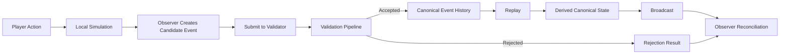

# CrypSA Worked Example

> Illustrative note: This document is illustrative.
> For authoritative behavior, see `spec/`.

---

This example uses concepts from:

→ CrypSA_In_5_Minutes.md
→ CrypSA_Terminology_Primer.md

You should be familiar with:

* validator
* canonical event history
* observer

---

## 📜 Authority Level

The `/spec` directory is the **authoritative definition of runtime behavior**.

This document shows how the system behaves.
The spec defines how it must behave.

If there is any conflict, **the spec takes precedence**.

---

## What This Example Shows

This walkthrough follows a complete event lifecycle:

* a local action
* becomes a candidate event
* crosses the invariant boundary
* becomes canonical (or is rejected)
* updates canonical event history
* and is reconciled by observers

---

## 📊 Runtime Flow Overview



---

## Scenario

A player places a mining station on an empty tile.

---

## Initial Canonical State

Derived via replay:

* tile_42 → empty
* player_A → resources = 100

Observers have reconstructed this state locally.

---

# Phase 1 — Local Action (Observer)

The player performs:

> Place mining station on tile_42

The observer:

* applies a **local prediction**
* shows the structure immediately
* marks the action as **pending**

At this point:

* local state ≠ canonical state
* no shared change has occurred

---

# Phase 2 — Candidate Event Creation

The observer creates a **candidate event** (not yet canonical):

```text
event_type = place_structure
actor_id = player_A
target_ids = [tile_42]

payload = {
  structure_type: mining_station,
  cost: 50
}

precondition_refs = {
  tile_42_empty: true,
  player_resources_sufficient: true
}

event_id = evt_001
```

This event represents **intent**, not reality.

---

# Phase 3 — Submission

The observer submits the candidate event to the validator.

State at this moment:

| Layer     | State                             |
| --------- | --------------------------------- |
| Local     | mining_station placed (predicted) |
| Canonical | tile_42 still empty               |

---

# Phase 4 — Validation Pipeline (Validator)

The event crosses the **invariant boundary**.

The validator evaluates the candidate event through validation layers:

### Schema Validation

✅ pass

### Identity Validation

✅ pass

### Precondition Validation

✅ pass

### Invariant Validation

✅ pass

### Rule Validation

✅ pass

---

# Phase 5 — Validation Outcome (Accepted)

The validator accepts the event after all validation layers pass.

If accepted, an event becomes canonical and is appended to canonical event history.

Canonical metadata is assigned:

```text
canonical_event_id = canon_1203
canonical_sequence = 1203
accepted_at = timestamp
```

This event is now **canonical**.

---

# Phase 6 — Replay and Derived State

Replay applies canonical events from canonical event history in `canonical_sequence` order.

Derived canonical state updates:

* tile_42 → mining_station
* player_A resources → 50

> Derived canonical state is a projection of canonical event history. It is not the source of truth.

---

# Phase 7 — Broadcast

The canonical event is propagated to observers.

---

# Phase 8 — Observer Reconciliation

Each observer compares:

* local predicted state
* canonical update

---

## Case A — Prediction Matches

* no visible change
* pending marker cleared

---

## Case B — Prediction Differs

* local state is corrected
* invalid objects removed
* canonical state applied

---

## Adapter and Lens Interpretation

After reconciliation:

* adapters reshape data
* lenses interpret meaning
* UI renders the result

```text
Canonical Update → Adapter → Lens → UI
```

---

# Alternative Scenario — Conflict

Two players attempt to place on tile_42.

---

## Validator Behavior

* evaluates both candidate events
* accepts the first valid event
* the second event does not become canonical and does not enter canonical event history

---

## Rejection Result

```text
result = rejected
reason = precondition_failed
```

---

## Observer Reconciliation

Rejected observer:

* removes predicted structure
* updates to canonical state via replay

---

# What This Demonstrates

* actions are proposals, not guarantees
* the validator defines what becomes canonical
* canonical event history is the source of truth
* observers may temporarily diverge
* reconciliation restores consistency

---

# Relationship to Specs

This example corresponds to:

* Runtime Model → overall flow
* Event Model → candidate event structure
* Validation Model → validation stages
* Consistency Model → reconciliation
* Replay Model → reconstruction

---

# One Sentence Summary

A local action becomes a candidate event, the validator evaluates it, if accepted, an event becomes canonical and is appended to canonical event history, and observers reconcile their local simulation to that shared history.
