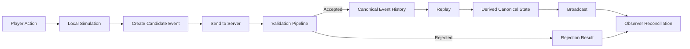

# CrypSA - Cryptid Server Architecture

CrypSA is an event-driven architecture for building persistent digital worlds.

Instead of synchronizing full world state, CrypSA synchronizes **canonical event history and invariant rules**.

Observers simulate the world locally, while a server validates events and preserves shared truth.

For documentation precedence and folder roles, see `DOCS_STRUCTURE.md`.

---

## 🚀 Start Here

If you're new to CrypSA:

1. 📘 `CrypSA_In_5_Minutes.md` — quick overview
2. 📖 `CrypSA_Terminology_Primer.md` — understand the vocabulary
3. ❓ `FAQ.md` — common questions and concerns

---

## 🧠 For Technical Readers

If you want to understand how CrypSA actually works:

1. `spec/CrypSA_Runtime_Spec_v0.1.md`
2. `spec/README.md` (spec reading order)
3. `implementation/CrypSA_Minimal_Server_v0.1.md`

These define the runtime behavior and how the system can be implemented.

---

## 🔄 The Core Idea

Traditional multiplayer systems:

* server simulates the world
* clients receive state updates

CrypSA:

* clients (observers) simulate locally
* actions become candidate events
* server validates events
* accepted events form canonical event history
* world state is reconstructed via replay

> The system moves from synchronizing state → to agreeing on events.

In CrypSA:

> state is not stored as truth — it is derived from canonical event history via replay

> canonical events are immutable once accepted

---

## 🧠 Mental Model

CrypSA is easiest to understand as four responsibilities:

* **Truth** — canonical events and validation
* **Translation** — adapters shaping runtime data
* **Interpretation** — lenses determining observer meaning
* **Experience** — UI and local interaction

These responsibilities are explored in more detail in:

* `CrypSA_In_5_Minutes.md`
* `architecture/`

---

## 📊 How CrypSA Works (Visual Overview)



For more diagrams, see:

👉 `diagrams/`

---

## ⚙️ What CrypSA Enables

* Persistent worlds independent of specific servers
* Deterministic world reconstruction
* Built-in replay and debugging via event history
* Flexible client-side simulation
* Strong invariant-based validation
* Potential for new gameplay models (branching timelines, observer-driven views)

---

## 🧩 Key Concepts

* **Minted Identities** — persistent object identities
* **Genomes** — versioned object definitions
* **Canonical Events** — immutable events forming canonical event history
* **Invariants** — rules that must always hold
* **Observers** — clients that reconstruct and simulate
* **Lenses** — interpretation layers (view-dependent logic)

See `CrypSA_Terminology_Primer.md` for detailed explanations.

---

## 📁 Repository Structure

### Exploratory Foundation

Conceptual framing and motivation.

Exploratory background only. For the current model, prefer `CrypSA_In_5_Minutes.md`, `architecture/`, and `spec/`.

```
exploratory/foundation/
```

---

### Core Concepts

High-level system models.

Exploratory models and earlier explanatory documents. Do not treat this folder as the current source of truth.

```
exploratory/core_concepts/
```

---

### Architecture

How CrypSA operates conceptually.

This is an authoritative system-explanation layer.

```
architecture/
```

---

### Specifications (Core Runtime Behavior)

Formal system definitions.

```
spec/
```

Includes:

* runtime model
* event model
* validation model
* consistency model
* replay model
* snapshot model
* identity model
* transport model

---

### Design

Use cases, patterns, and applicability.

```
design/
```

---

### Implementation

Practical guides and prototype direction.

This folder describes implementation strategy and project direction. For system behavior, prefer `spec/`.

```
implementation/
```

---

### Teaching

Educational materials and example implementations.

```
teaching/
```

Includes:

* `crypsa_teaching_prototype/` — completed teaching prototype

---

### Diagrams

Visual explanations of system behavior.

Supporting material only. For authoritative behavior, prefer `spec/`.

```
diagrams/
```

---

### Atlas

Glossary and navigation support.

```
atlas/
```

---

## 🛠 Current Project Status

CrypSA is currently:

* a defined architecture with formal specifications
* supported by documentation and a teaching prototype
* not yet a production-ready system

Next major step:

→ building a minimal independent server to validate the runtime model

See:

`implementation/CrypSA_Project_Status.md`

---

## 🧪 Teaching Prototype

CrypSA includes a completed teaching prototype located in:

`teaching/crypsa_teaching_prototype/`

For authoritative prototype status, see:

`teaching/crypsa_teaching_prototype/STATUS.md`

This prototype is intended to:

* demonstrate the CrypSA model in a live, inspectable system
* show how canonical events, validation, replay, and observers interact
* support learning and experimentation

It is **not**:

* a production runtime
* a distributed server implementation
* a scalability or networking proof

Status:

* Complete for its intended purpose
* Frozen except for bug fixes and documentation updates

Future CrypSA work (such as a minimal server/runtime) will be developed as separate programs rather than extending this prototype indefinitely.

---

## 🧭 Recommended Reading Path

### 1. Understand the Idea

1. `CrypSA_In_5_Minutes.md`
2. `CrypSA_Terminology_Primer.md`
3. `FAQ.md`

---

### 2. See a Concrete Example

4. `CrypSA_WORKED_EXAMPLE.md`

---

### 3. Understand the Architecture

5. `architecture/`
6. `spec/`

---

### 4. See the Model in Practice

7. `teaching/crypsa_teaching_prototype/`

---

### 5. Move Toward Implementation

8. `implementation/CrypSA_Minimal_Server_v0.1.md`

---

## ⚠️ Scope and Limitations

CrypSA v0.1 is best suited for:

* persistent worlds
* simulation-heavy systems
* object-driven interactions

It is not yet optimized for:

* twitch shooters
* frame-perfect PvP
* heavy physics-based simulation

---

## 👤 Author

Beau Wells

---

## 📄 License

Creative Commons Attribution 4.0 International (CC BY 4.0)

---

## 📌 Citation

If referencing this work, see `CITATION.cff`.

---

## One Sentence Summary

CrypSA is an event-driven architecture where clients simulate locally, servers validate events, and shared reality is defined by canonical event history.
