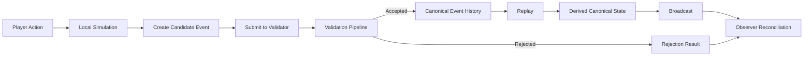

# CrypSA — Cryptid Server Architecture

CrypSA defines how systems agree on truth through validated canonical events.

It is an event-driven architecture for building persistent digital worlds.

Rather than synchronizing full world state, CrypSA synchronizes validated canonical events under invariant rules.

All canonical changes pass through the invariant boundary, where system invariants are enforced.

Observers simulate locally. The validator defines what becomes canonical—and therefore what becomes shared reality.

> Reality is not synchronized — it is agreed upon through validated events.  
> The validator defines what becomes canonical.  
> Canonical event history is the source of truth.

The validator may run locally or remotely, but its role does not change.

---

## 🚀 Start Here

If you're new to CrypSA, follow this path:

1. 🧭 CrypSA_In_One_Diagram.md — see the system at a glance  
2. 📘 CrypSA_In_5_Minutes.md — understand the core idea  
3. 📖 CrypSA_Terminology_Primer.md — learn the language  
4. 📖 CrypSA_Worked_Example.md — see it in action  

---

## ⚙️ System Model (At a Glance)

CrypSA follows a consistent event lifecycle:

1. Observer simulates locally  
2. Observer proposes a **candidate event**  
3. Validator evaluates the event  
4. If accepted, an event becomes canonical and is appended to canonical event history  
5. Observers reconcile to canonical truth  

This defines the boundary between:

* local simulation (non-authoritative)  
* canonical reality (validator-defined)

Canonical event history is an append-only log that defines the shared reality of the system.

All derived state must be consistent with this history.

---

## 🛠 Build CrypSA

Start implementing a CrypSA system with the minimal validator:

👉 implementation/minimal_validator/CrypSA_Minimal_Validator_v0.1.md  

Then follow:

👉 implementation/CrypSA_Local_First_Development_Approach.md  

---

## 🧠 What CrypSA Is (and Is Not)

CrypSA defines how systems establish and maintain canonical truth over time through validated events.

It provides a model where:

* truth is validated, not assumed  
* state is derived, not synchronized  
* simulation is local, but canonical authority is enforced by the validator  

> Derived canonical state is a projection of canonical event history. It is not the source of truth.

---

### ✅ CrypSA Is

CrypSA is:

* a structured architecture model  
* a set of invariants around truth, validation, and canonical event history  
* a framework for building replayable, consistent systems  

It defines:

👉 what must be true for a system to maintain canonical agreement

CrypSA is typically integrated alongside existing systems such as game engines, simulation layers, and networking stacks.

Systems built with CrypSA are inherently replayable from canonical event history.

---

### ❌ CrypSA Is NOT

CrypSA is not:

* a fixed networking architecture  
* a required client-server topology  
* a one-size-fits-all implementation  
* a game engine  
* a networking library  
* a state replication system  
* an ECS framework  

> CrypSA defines truth agreement, not rendering, transport, or simulation.

---

### 🧭 What CrypSA Defines vs Leaves Open

CrypSA defines:

* how events become canonical  
* how truth is established  
* how state is derived from canonical event history  

CrypSA intentionally leaves open:

* how systems are structured at runtime  
* how networking is implemented  
* how reconciliation and prediction are handled  
* how systems are shaped to meet product goals  

👉 CrypSA defines invariants and structure, not a single implementation.

👉 CrypSA provides a structured design space for making these decisions.

👉 Implementers are expected to choose these based on product requirements.

---

### 📘 Learn More

For a full breakdown of invariants and product-dependent design:

👉 architecture/CrypSA_Invariants_and_Design_Space.md — defines invariants and guides product-level design decisions

## ⚙️ How CrypSA Works

> If accepted, an event becomes canonical and is appended to canonical event history.

---

## 📚 Documentation Guide

CrypSA documentation is structured by role:

| Type         | Purpose                                 |
| ------------ | --------------------------------------- |
| Conceptual   | Mental models and explanations          |
| Architecture | System structure and boundaries         |
| Spec         | Authoritative runtime behavior          |
| Example      | Concrete walkthroughs                   |
| Diagram      | Visual explanations (non-authoritative) |
| Exploratory  | Non-final ideas                         |

👉 Full structure: DOCS_STRUCTURE.md

---

## 🧭 Full Reading Path

### Foundation

* CrypSA_In_One_Diagram.md  
* CrypSA_In_5_Minutes.md  
* CrypSA_Terminology_Primer.md  

### Motivation

* CrypSA_Why_It_Exists.md  

### Example

* CrypSA_Worked_Example.md  

### Architecture

* architecture/  

### Runtime (Required for Implementation)

* spec/  

### Implementation

* implementation/  

---

## 👥 Who This Is For

### 🧠 Learners

Start with:

* CrypSA_In_5_Minutes.md  
* CrypSA_Worked_Example.md  

---

### ⚙️ Implementers

Focus on:

* spec/  
* minimal validator docs  

> The spec defines behavior — your implementation must follow it.

---

### 🧱 Contributors

Read:

* terminology primer  
* architecture  
* spec  
* CONTRIBUTING.md  

Before submitting:

→ run: `docs/DOCS_LINT_CHECKLIST.md`  
→ ensure the docs gate will pass  

Follow:

* do not redefine terminology  
* do not duplicate definitions  
* do not introduce behavior outside the spec  

---

## 🚧 Project Status — v1.0

CrypSA v1.0 defines the core architecture and runtime model.

It is:

* stable in its core concepts  
* consistent in terminology and structure  
* ready for implementation  

Ongoing work includes:

* reference implementations  
* documentation refinement  

> v1.0 is a stable architectural baseline, not a finished product.

---

## 🔢 Versioning Philosophy

* v1.x → stable architecture, evolving implementations  
* v2.0 → breaking architectural changes  

---

## 🧠 Why CrypSA Exists

Traditional systems:

Client → Server → State Sync  

CrypSA:

Observer → Validator → Canonical Event History → Reconstruction  

Instead of synchronizing state, it:

* validates events  
* records canonical history  
* reconstructs reality deterministically  

---

## 🧩 Key Concepts

* Validator  
* Canonical Events  
* Invariants  
* Observers  
* Lenses  

See:

CrypSA_Terminology_Primer.md  

---

## 📁 Repository Structure

* architecture/  
* spec/  
* implementation/  
* diagrams/  
* exploratory/  
* teaching/  
* atlas/  

---

## 👤 Author

Beau Wells  

---

## One Sentence Summary

CrypSA defines how systems agree on truth through validated canonical events.
