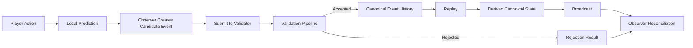

> ⚠️ This repository defines an architecture model.
> If you are reviewing it, please read REVIEWER_GUIDE.md first.

# CrypSA — Cryptid Server Architecture

CrypSA defines how systems establish canonical truth through validated events and deterministic replay.

In CrypSA:

* the validator defines what becomes canonical  
* canonical event history is the source of truth  
* derived canonical state is reconstructed via replay  

It is an event-driven architecture for building persistent digital worlds.

> Reality is not synchronized — it is agreed upon through validated events.  
> Canonical event history is the source of truth.

---

## 🧠 Overview

For a full conceptual explanation of CrypSA:

👉 `./CrypSA_Overview.md`

---

## 🚀 Start Here (Required Path)

If this is your first time reading CrypSA, follow this path:

1. 🧭 `CrypSA_In_One_Diagram.md` — see the system at a glance  
2. 📘 `CrypSA_In_5_Minutes.md` — understand the core idea  
3. 📖 `CrypSA_Terminology_Primer.md` — learn the language  
4. 📖 `CrypSA_Worked_Example.md` — see it in action  

---

👉 **Only after completing the above:**

**These documents assume familiarity with the core model.**

5. 🏗 `architecture/` — understand system structure  
6. 📜 `/spec` — understand authoritative runtime behavior  

---

⚠️ **Do not start with `/spec` on your first pass.**  
CrypSA is concept-driven and requires the mental model first.

---

## 📘 Additional Navigation

For a deeper walkthrough of how to read CrypSA:

👉 `How_To_Read_CrypSA.md`

For core terminology:

👉 `CrypSA_Terminology_Primer.md`

---

## 🧭 Reading Modes

Choose your path based on your goal:

---

### First-time reader  
Follow the **Start Here (Required Path)** above.

---

### Architecture deep dive  
Go to:

👉 `architecture/`

---

### Formal behavior (authoritative)  
Go to:

👉 `/spec`

---

### Implementation / building  
Go to:

👉 `implementation/`

---

## 🧠 What CrypSA Is (and Is Not)

CrypSA defines how systems establish and maintain canonical truth through validated events.

It provides a model where:

* truth is validated, not assumed  
* the validator defines what becomes canonical  
* state is derived, not synchronized  
* simulation is local, but canonical authority is enforced by the validator  

> Derived canonical state is a projection of canonical event history. It is not the source of truth.

---

### ✅ CrypSA Is

CrypSA is:

* a structured architecture model  
* a set of invariants around truth, validation, and canonical event history  
* a framework for building replayable and consistent systems  

---

### ❌ CrypSA Is NOT

CrypSA is not:

* a fixed networking architecture  
* a required client-server topology  
* a one-size-fits-all implementation  
* a game engine  
* a networking library  
* a state replication system  
* an ECS framework  
* a state synchronization model  

> CrypSA defines truth agreement, not rendering, transport, or simulation.

---

## 🛠 Build CrypSA

Start with the smallest working system:

👉 `implementation/CrypSA_Minimal_Runtime_Walkthrough.md`

Then explore:

👉 `implementation/minimal_validator/CrypSA_Minimal_Validator_v0.1.md`  
👉 `implementation/CrypSA_Local_First_Development_Approach.md`

---

## 📘 Learn More

For deeper architectural breakdowns and design space:

👉 `architecture/CrypSA_Invariants_and_Design_Space.md`  
👉 `architecture/CrypSA_Boundary_Definitions.md`

For system structure:

👉 `architecture/`

---

## ⚙️ How CrypSA Works (High-Level)

For the full runtime flow, see:

👉 `architecture/CrypSA_Runtime_Model.md`
