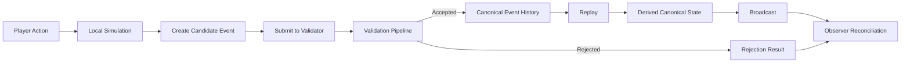

# CrypSA — Cryptid Server Architecture

CrypSA is an event-driven architecture for building persistent digital worlds.

Instead of synchronizing full world state, CrypSA synchronizes **validated canonical events under invariant rules**.

Observers simulate the world locally, while a **validator** determines what becomes canonical truth.

> Reality is not synchronized — it is agreed upon through validated events.

> The validator defines canonical truth.
> It may run locally or remotely, but its role does not change.

For documentation precedence and folder roles, see `DOCS_STRUCTURE.md`.

---

## 📚 Document Types

CrypSA documentation is organized by role.

Each document serves a specific purpose and should not duplicate others.

---

### Conceptual

Explain ideas and mental models.

* high-level understanding
* learning-oriented
* not authoritative

---

### Architecture

Define system structure and relationships.

* how components fit together
* responsibilities and boundaries
* authoritative for system design

---

### Spec

Define **runtime behavior**.

* exact rules the system must follow
* validation logic
* event and state behavior

> The `/spec` directory is the source of truth for implementation.

---

### Example

Illustrate how the system works in practice.

* step-by-step flows
* applied scenarios
* learning support

---

### Diagram

Visual explanations of the system.

* support understanding
* non-authoritative
* must align with architecture and spec

---

### Exploratory

Early ideas and non-final concepts.

* not part of the core architecture
* may evolve or be removed
* not authoritative

---

## 🔒 Rule

Documents must not redefine concepts outside their role.

* Definitions → Terminology Primer
* Structure → Architecture
* Behavior → Spec

This ensures clarity and prevents duplication.

---

## 🧭 Start Here (Required Reading Order)

If you are new to CrypSA, follow this order.

Do not skip ahead — later documents assume earlier understanding.

---

### 1. Understand the Core Idea

1. 🧭 `CrypSA_In_One_Diagram.md` — the entire system in one view
2. 📘 `CrypSA_In_5_Minutes.md` — quick mental model
3. 📖 `CrypSA_Terminology_Primer.md` — core vocabulary

---

### 2. Understand the Motivation

4. 🧠 `Why_CrypSA_Exists.md` — problem framing and why this architecture exists

---

### 3. See It in Action

5. 📖 `CrypSA_Worked_Example.md` — step-by-step flow of the system

---

### 4. Understand the Architecture

6. 🧱 `architecture/` — authoritative architecture definitions

---

### 5. Understand the Runtime (Required for Implementation)

7. ⚙️ `spec/` — **authoritative runtime behavior**

> If you are implementing CrypSA, the `/spec` directory is the source of truth.
> Architecture documents explain the system — the spec defines how it must behave.

---

### 6. Move Toward Implementation

8. 🛠 `implementation/CrypSA_Minimal_Server_v0.1.md`
9. 🧭 `implementation/CrypSA_Local_First_Development_Approach.md`

---

### 7. Explore (Optional)

* ❓ `FAQ.md` — common questions
* 📊 `diagrams/` — visual explanations (non-authoritative)
* 🧪 `teaching/` — learning prototype (not runtime)

---

## 🧠 Why CrypSA Exists

Traditional multiplayer systems synchronize state:

```text
Client → Server → State Sync
```

This leads to:

* complex server-side simulation
* difficult scaling
* tightly coupled systems
* limited flexibility

CrypSA takes a different approach:

```text
Observer → Validation → Canonical Event History → Reconstruction
```

Instead of synchronizing state, it:

* validates events
* records canonical history
* reconstructs reality deterministically

This creates a system that is:

* easier to reason about
* replayable by design
* flexible in deployment (local or remote validator)
* naturally aligned with persistent worlds

---

## 🧠 For Technical Readers

If you want to understand how CrypSA actually works:

1. `spec/CrypSA_Runtime_Spec_v0.1.md`
2. `spec/CrypSA_Spec_Index.md` (spec reading order)
3. `implementation/CrypSA_Minimal_Server_v0.1.md`

These define runtime behavior (spec) and how the system can be implemented (implementation).

---

## 🔄 The Core Idea

Traditional multiplayer systems:

* server simulates the world
* clients receive state updates

CrypSA:

* observers simulate locally
* actions become candidate events
* a validator evaluates events
* accepted events are appended to canonical event history
* derived canonical state is reconstructed via replay

> The system moves from synchronizing state → to agreeing on events

In CrypSA:

> state is not stored as truth — it is derived from canonical event history via replay

> canonical event history is append-only

---

## 🧠 Mental Model

CrypSA is easiest to understand as four responsibilities:

* **Truth** — canonical events and validation
* **Translation** — adapters shaping runtime data
* **Interpretation** — lenses determining observer meaning
* **Experience** — UI and local interaction

See:

* `CrypSA_In_5_Minutes.md`
* `architecture/`

---

## 📊 How CrypSA Works (Visual Overview)



For more diagrams:

👉 `diagrams/`

---

## ⚙️ What CrypSA Enables

* Persistent worlds independent of specific deployments
* Deterministic world reconstruction
* Built-in replay and debugging via event history
* Flexible client-side simulation
* Strong invariant-based validation
* Flexible deployment (local, host-based, or remote validator)
* Local-first and offline-capable development
* New gameplay models (observer-driven views, replay-based systems)

---

## 🧩 Key Concepts

* **Validator** — determines what becomes canonical truth
* **Minted Identities** — persistent object identities
* **Genomes** — deterministic object definitions
* **Canonical Events** — immutable events forming canonical event history
* **Invariants** — rules that must always hold
* **Observers** — systems that reconstruct and simulate
* **Lenses** — interpretation layers

See:

`CrypSA_Terminology_Primer.md`

---

## 🛠 Implementation Guidance

CrypSA is designed to be built **local-first**.

This means:

* start with a local validator
* validate the architecture locally
* move to multiplayer as a deployment change, not a rewrite

👉 See:

```
implementation/CrypSA_Local_First_Development_Approach.md
```

---

## 📁 Repository Structure

### Exploratory Foundation

Conceptual framing and motivation

```
exploratory/foundation/
```

---

### Core Concepts

High-level system models (non-authoritative)

```
exploratory/core_concepts/
```

---

### Architecture

How CrypSA is structured

```
architecture/
```

---

### Specifications (Core Runtime Behavior)

Authoritative system behavior

```
spec/
```

---

### Design

Use cases and applicability

```
design/
```

---

### Implementation

How to build CrypSA systems

```
implementation/
```

---

### Teaching

Learning materials and prototype

```
teaching/
```

---

### Diagrams

Visual explanations (non-authoritative)

```
diagrams/
```

---

### Atlas

Glossary and navigation

```
atlas/
```

---

## 🛠 Current Project Status

CrypSA is currently:

* a defined architecture with formal specifications
* supported by documentation and a teaching prototype
* not yet a production-ready system

Next major step:

→ build a minimal validator (local-first, then extendable to remote)

See:

```
implementation/CrypSA_Project_Status.md
```

---

## 🧪 Teaching Prototype

Located in:

```
teaching/CrypSA_teaching_prototype/
```

This prototype:

* demonstrates validation, replay, and observers
* is a learning tool
* is **not a production runtime**

---

## ⚠️ Scope and Limitations

CrypSA v0.1 is best suited for:

* persistent worlds
* simulation-heavy systems
* object-driven interactions

It is not yet optimized for:

* twitch shooters
* frame-perfect PvP
* heavy physics-based simulation

---

## 👤 Author

Beau Wells

---

## 📄 License

Creative Commons Attribution 4.0 International (CC BY 4.0)

---

## 📌 Citation

See `CITATION.cff`.

---

## One Sentence Summary

CrypSA is an event-driven architecture where observers simulate locally, a validator evaluates events, and shared reality is defined by canonical event history.
