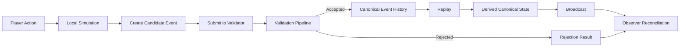

# CrypSA — Cryptid Server Architecture

CrypSA is an event-driven architecture for building persistent digital worlds.

Instead of synchronizing full world state, CrypSA synchronizes **validated canonical events under invariant rules**.

Observers simulate the world locally, while a **validator** determines what becomes canonical truth.

> Reality is not synchronized — it is agreed upon through validated events.

> The validator defines canonical truth.
> It may run locally or remotely, but its role does not change.

For documentation precedence and folder roles, see `DOCS_STRUCTURE.md`.

---

## 🚧 Project Status — v1.0

CrypSA v1.0 defines the **core architecture and runtime model**.

This version is:

* stable in its core concepts
* consistent in terminology and structure
* ready for implementation

However:

* reference implementations are still in progress
* documentation may continue to improve
* minor refinements may be made without changing core principles

> v1.0 represents a stable architectural baseline, not a finished product.

---

## 📚 Document Types

CrypSA documentation is organized by role.

Each document serves a specific purpose and should not duplicate others.

---

### Conceptual

Explain ideas and mental models.

* high-level understanding
* learning-oriented
* not authoritative

---

### Architecture

Define system structure and relationships.

* how components fit together
* responsibilities and boundaries
* authoritative for system design

---

### Spec

Define **runtime behavior**.

* exact rules the system must follow
* validation logic
* event and state behavior

> The `/spec` directory is the source of truth for implementation.

---

### Example

Illustrate how the system works in practice.

* step-by-step flows
* applied scenarios
* learning support

---

### Diagram

Visual explanations of the system.

* support understanding
* non-authoritative
* must align with architecture and spec

---

### Exploratory

Early ideas and non-final concepts.

* not part of the core architecture
* may evolve or be removed
* not authoritative

---

## 🔒 Rule

Documents must not redefine concepts outside their role.

* Definitions → Terminology Primer
* Structure → Architecture
* Behavior → Spec

This ensures clarity and prevents duplication.

---

## 🧭 Start Here (Required Reading Order)

If you are new to CrypSA, follow this order.

Do not skip ahead — later documents assume earlier understanding.

---

### 1. Understand the Core Idea

1. 🧭 `CrypSA_In_One_Diagram.md` — the entire system in one view
2. 📘 `CrypSA_In_5_Minutes.md` — quick mental model
3. 📖 `CrypSA_Terminology_Primer.md` — core vocabulary

---

### 2. Understand the Motivation

4. 🧠 `Why_CrypSA_Exists.md` — problem framing and why this architecture exists

---

### 3. See It in Action

5. 📖 `CrypSA_Worked_Example.md` — step-by-step flow of the system

---

### 4. Understand the Architecture

6. 🧱 `architecture/` — authoritative architecture definitions

---

### 5. Understand the Runtime (Required for Implementation)

7. ⚙️ `spec/` — **authoritative runtime behavior**

> If you are implementing CrypSA, the `/spec` directory is the source of truth.
> Architecture documents explain the system — the spec defines how it must behave.

---

### 6. Move Toward Implementation

8. 🛠 `implementation/CrypSA_Minimal_Server_v0.1.md`
9. 🧭 `implementation/CrypSA_Local_First_Development_Approach.md`

---

### 7. Explore (Optional)

* ❓ `FAQ.md` — common questions
* 📊 `diagrams/` — visual explanations (non-authoritative)
* 🧪 `teaching/` — learning prototype (not runtime)

---

## 👥 Who This Is For

CrypSA is designed for different types of readers.

Use this section to quickly find your path.

---

### 🧠 Learners

You want to understand the ideas and mental model.

Start with:

* `CrypSA_In_5_Minutes.md`
* `CrypSA_Worked_Example.md`
* `CrypSA_Terminology_Primer.md`

Then explore:

* `architecture/`
* `diagrams/`

---

### ⚙️ Implementers

You want to build a system using CrypSA.

Focus on:

* `spec/` — **authoritative runtime behavior**
* `implementation/CrypSA_Minimal_Server_v0.1.md`
* `implementation/CrypSA_Local_First_Development_Approach.md`

Key rule:

> The spec defines behavior — your implementation must follow it.

---

### 🧱 Contributors

You want to extend or contribute to CrypSA.

Read:

* `CrypSA_Terminology_Primer.md` (required)
* `architecture/` (structure and boundaries)
* `spec/` (authoritative behavior)

Follow these rules:

* do not redefine terminology
* do not duplicate definitions
* do not introduce behavior outside the spec

---

## 🧭 Quick Guidance

If unsure:

* start as a **learner**
* move to **implementer** when building
* become a **contributor** once familiar with the system

---

## 🧠 Why CrypSA Exists

Traditional multiplayer systems synchronize state:

```text
Client → Server → State Sync
```

This leads to:

* complex server-side simulation
* difficult scaling
* tightly coupled systems
* limited flexibility

CrypSA takes a different approach:

```text
Observer → Validation → Canonical Event History → Reconstruction
```

Instead of synchronizing state, it:

* validates events
* records canonical history
* reconstructs reality deterministically

This creates a system that is:

* easier to reason about
* replayable by design
* flexible in deployment (local or remote validator)
* naturally aligned with persistent worlds

---

## 🧠 For Technical Readers

If you want to understand how CrypSA actually works:

1. `spec/CrypSA_Runtime_Spec_v0.1.md`
2. `spec/CrypSA_Spec_Index.md` (spec reading order)
3. `implementation/CrypSA_Minimal_Server_v0.1.md`

---

## 🔄 The Core Idea

Traditional multiplayer systems:

* server simulates the world
* clients receive state updates

CrypSA:

* observers simulate locally
* actions become candidate events
* a validator evaluates events
* accepted events are appended to canonical event history
* derived canonical state is reconstructed via replay

---

## 📊 How CrypSA Works (Visual Overview)



---

## ⚙️ What CrypSA Enables

* Persistent worlds independent of specific deployments
* Deterministic world reconstruction
* Built-in replay and debugging via event history
* Flexible client-side simulation
* Strong invariant-based validation
* Flexible deployment (local, host-based, or remote validator)
* Local-first and offline-capable development
* New gameplay models (observer-driven views, replay-based systems)

---

## ❌ What CrypSA Is Not

CrypSA is often misunderstood if mapped onto familiar systems.

It is important to clarify what it is **not**.

---

CrypSA is **not**:

### A Game Engine

CrypSA does not provide:

* rendering
* physics
* asset pipelines
* scene management

---

### A Networking Library

CrypSA does not prescribe:

* transport protocols
* connection handling
* packet formats

---

### A State Replication System

CrypSA does not synchronize full world state.

Instead:

* it synchronizes **validated canonical events**
* state is reconstructed locally via replay

---

### An ECS Framework

CrypSA does not define:

* entity-component storage
* system execution models
* data-oriented design patterns

---

## 🧠 Key Distinction

CrypSA defines how systems agree on what is real — not how they render, simulate, or transport it.

---

## 🧩 Key Concepts

* **Validator**
* **Canonical Events**
* **Invariants**
* **Observers**
* **Lenses**

See:

`CrypSA_Terminology_Primer.md`

---

## 🛠 Implementation Guidance

CrypSA is designed to be built **local-first**.

👉 See:

`implementation/CrypSA_Local_First_Development_Approach.md`

---

## 📁 Repository Structure

```
exploratory/
architecture/
spec/
implementation/
teaching/
diagrams/
atlas/
```

---

## 🛠 Current Project Status

CrypSA is currently:

* architecture defined
* specs written
* not yet implemented

Next step:

→ build minimal validator

---

## 👤 Author

Beau Wells

---

## One Sentence Summary

CrypSA defines how systems agree on truth through validated canonical events.
