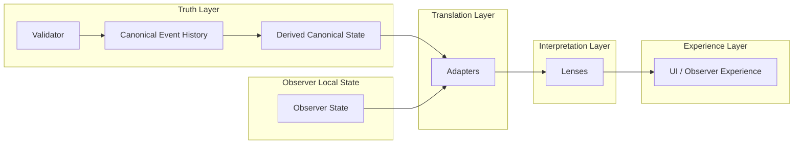

# CrypSA Adapter, Lens, and Runtime Relationship

## Purpose

This diagram shows how CrypSA separates:

* **truth**
* **translation**
* **interpretation**
* **experience**

It also clarifies how canonical truth is established before it flows into the rest of the system.

---

## System Relationship Diagram



---

## How to Read This

### Truth Layer

The truth layer defines what is real.

It includes:

* the **validator**, which determines what becomes canonical
* **canonical event history**, which defines what is true
* **derived canonical state**, which is reconstructed from canonical history

The validator:

* accepts or rejects candidate events
* enforces invariants
* appends accepted events to canonical event history

Derived canonical state is useful, but it is not more authoritative than canonical event history.

> Canonical truth is defined by validation, not by derived state.

---

### Observer Local State

Observers maintain local state such as:

* simulation state
* prediction state
* selection and interaction context

This state is local and non-authoritative.

It may be combined with canonical data when preparing information for interpretation.

---

### Translation Layer

Adapters belong to the **translation layer**.

They:

* reshape canonical and observer data
* combine data from different local sources
* prepare structured outputs for interpretation

Adapters answer:

> “How should this data be structured for use?”

They do not define truth, validation, or meaning.

---

### Interpretation Layer

Lenses belong to the **interpretation layer**.

They:

* interpret adapted data
* determine visibility
* define interaction meaning
* produce observer-specific views

Lenses answer:

> “What does this mean for this observer?”

They do not define truth.

---

### Experience Layer

The experience layer includes:

* UI
* rendering
* interaction handling
* local feedback

This is what the observer experiences.

---

## Key Insight

> Truth, translation, interpretation, and experience are separate responsibilities.

And critically:

> truth is established by validation before it flows into the rest of the system

This separation is one of the core architectural boundaries in CrypSA.

---

## Simplified Flow

```text
Validator → Canonical Event History → Derived Canonical State → Adapters → Lenses → Experience
```

---

## Why This Matters

This separation allows CrypSA systems to remain:

* modular
* debuggable
* replayable
* flexible
* easier to evolve over time

Each layer can evolve independently without breaking the others.

---

## One Sentence Summary

CrypSA separates truth, translation, interpretation, and experience into distinct layers, where validation establishes canonical truth before it is translated, interpreted, and experienced.
