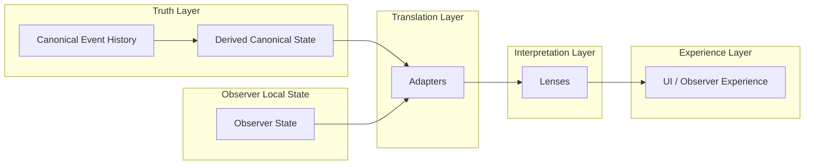

# CrypSA Adapter, Lens, and Runtime Relationship

## Purpose

This diagram shows how CrypSA separates:

* **truth**
* **translation**
* **interpretation**
* **experience**

---

## System Relationship Diagram



---

## How to Read This

### Truth Layer

The truth layer defines what is real.

* **Canonical event history** is the source of truth
* **Derived canonical state** is a convenience for access, reconstruction, and computation

Derived state is useful, but it is not more authoritative than canonical history.

---

### Observer Local State

Observers maintain local state such as:

* simulation state
* prediction state
* selection and interaction context

This state is local and non-authoritative.

It may be combined with canonical data when preparing information for interpretation.

---

### Translation Layer

Adapters belong to the **translation layer**.

They:

* reshape canonical and observer data
* combine data from different local sources
* prepare structured outputs for interpretation

Adapters answer:

> “How should this data be structured for use?”

They do not define truth, validation, or meaning.

---

### Interpretation Layer

Lenses belong to the **interpretation layer**.

They:

* interpret adapted data
* determine visibility
* define interaction meaning
* produce observer-specific views

Lenses answer:

> “What does this mean for this observer?”

They do not define canonical truth.

---

### Experience Layer

The experience layer includes:

* UI
* rendering
* interaction handling
* local feedback

This is what the observer actually experiences.

---

## Key Insight

> Truth, translation, interpretation, and experience are separate responsibilities.

This separation is one of the core architectural boundaries in CrypSA.

---

## Simplified Flow

```text
Canonical Events → Derived State → Adapters → Lenses → Experience
```

---

## Why This Matters

This separation allows CrypSA systems to remain:

* modular
* debuggable
* replayable
* flexible
* easier to evolve over time

Each layer can change without collapsing into the others.

---

## One Sentence Summary

CrypSA separates canonical truth, translation, interpretation, and experience into distinct layers so the system remains clear, modular, and extensible.
