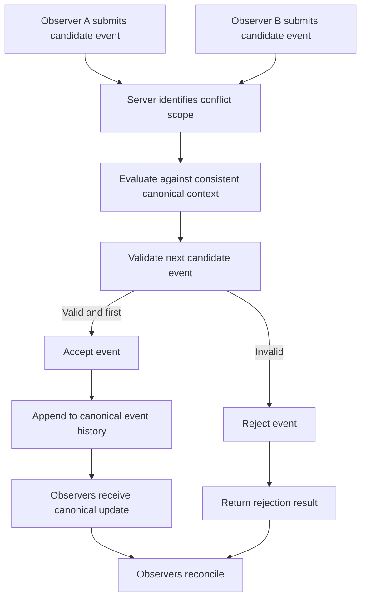

# CrypSA Conflict Resolution

## Purpose

This diagram shows how CrypSA resolves conflicting candidate events that target the same **conflict scope**.

Examples of conflict scope include:

* the same tile
* the same object
* the same inventory slot
* the same ownership target

In CrypSA v0.1:

> the first valid accepted event wins within the conflict scope

---

## Diagram

---

## How to Read This

### 1. Conflicting Actions Arrive

Multiple observers submit actions affecting the same conflict scope.

Examples:

* placing on the same tile
* claiming the same object
* consuming a unique resource

---

### 2. Evaluation Uses Canonical Context

The server evaluates events against a **consistent canonical context**.

This ensures:

* no simultaneous conflicting acceptance
* validation is based on a stable view of truth

---

### 3. One Event Is Accepted

In v0.1:

* the first valid event within the scope is accepted
* later conflicting events are rejected

---

### 4. Rejection Has a Defined Cause

Rejected events may fail because:

* the conflict was already resolved
* preconditions are no longer valid
* canonical state changed before validation

Typical results include:

* `conflict_lost`
* `precondition_failed`

---

### 5. Observers Reconcile

After the canonical event is accepted:

* observers receive the update
* local predictions are confirmed or corrected
* all observers converge to canonical truth

---

## Key Insight

> Conflict resolution is determined by validation against canonical truth, not by local simulation.

---

## Relationship to Specs

This diagram maps to:

* `spec/CrypSA_Runtime_Spec_v0.1.md`
* `spec/CrypSA_Validation_Model.md`
* `spec/CrypSA_Consistency_Model.md`

---

## One Sentence Summary

When multiple observers submit conflicting actions, the server evaluates them against canonical truth, accepts one valid event within the conflict scope, rejects the others, and observers reconcile to the resulting canonical state.
