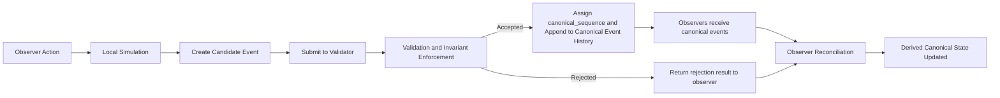

# CrypSA Event Flow

## Purpose

This diagram shows how a local observer action becomes part of canonical event history in CrypSA.

It represents the runtime loop:

> local simulation → validation → canonical event history → observer reconciliation

---

## Diagram

---

## How to Read This

### 1. Local Phase

* the observer performs an action
* the observer simulates it immediately
* a candidate event is created

At this point:

> the result is **not yet part of canonical event history**

---

### 2. Validation Phase

* the event is submitted to the validator
* the validator evaluates it against invariants and rules

Result:

* accepted
* rejected

The validator may run locally or remotely, but its role does not change.

---

### 3. Canonical Phase

If accepted:

* the validator assigns `canonical_sequence` (authoritative ordering)
* canonical_sequence defines the authoritative ordering of events
* the event is appended to canonical event history
* canonical events are made available to observers

Canonical event history is extended only through accepted events.

---

### 4. Reconciliation Phase

Observers:

* compare local prediction with updates from canonical event history
* correct or confirm local state
* continue simulation

---

## Key Insight

> Actions do not directly change reality.
> Validated events are ordered via `canonical_sequence` and appended to canonical event history.

And:

> validation is the boundary that determines what becomes canonical truth

---

## Relationship to Architecture

This diagram reflects:

* **Truth** → validation and canonical event history
* **Experience** → local simulation
* **Reconciliation** → convergence of observers

Adapters and lenses operate within the observer before and after this flow.

---

## Relationship to Specs

This diagram maps to:

* Runtime Spec — overall flow
* Event Model — candidate event creation
* Validation Model — invariant enforcement
* Consistency Model — reconciliation

---

## One Sentence Summary

A local action becomes a candidate event, the validator evaluates it against canonical event history, accepted events are recorded (with ordering via `canonical_sequence`) in canonical event history, and observers reconcile to derived canonical state.
