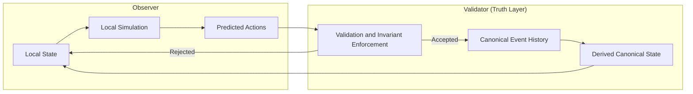

# Observer vs Canonical State

## Purpose

This diagram shows the relationship between:

* local observer simulation
* the validator’s role in defining canonical truth

It explains how CrypSA separates:

> what is predicted
> vs
> what is real

---

## Diagram

---

## How to Read This

### Observer Side

The observer maintains:

* local state
* local simulation
* predicted actions

These enable:

* responsiveness
* immediate feedback

However:

> this state is not authoritative

---

### Validator Side (Truth Layer)

The validator maintains:

* validation and invariant enforcement
* canonical event history
* derived canonical state

Canonical event history defines what is real.

Derived canonical state is a computed view, not the source of truth.

The validator may run locally or remotely, but its role does not change.

---

### Interaction Flow

1. the observer performs an action
2. the action becomes a candidate event
3. the validator evaluates the event

---

### Outcomes

#### Accepted

* event is appended to canonical event history
* canonical event history changes
* observers receive updates

---

#### Rejected

* canonical event history does not change
* observer corrects its local prediction

---

### Reconciliation

Observers update local state based on canonical event history.

This ensures:

> all observers converge to derived canonical state

---

## Key Insight

> The observer simulates freely.
> The validator determines what becomes real.
> Canonical event history corrects local state.

---

## Relationship to Architecture

This diagram reflects:

* **Truth** → validation and canonical event history
* **Experience** → local simulation and prediction

Adapters and lenses operate within the observer before and after this flow.

---

## Relationship to Specs

This diagram connects to:

* Runtime Spec — observer/validator roles
* Validation Model — invariant enforcement
* Consistency Model — reconciliation
* Replay Model — canonical reconstruction

---

## One Sentence Summary

Observers simulate locally and predict outcomes, but only validated events are appended to canonical event history, and all observers reconcile to derived canonical state.
