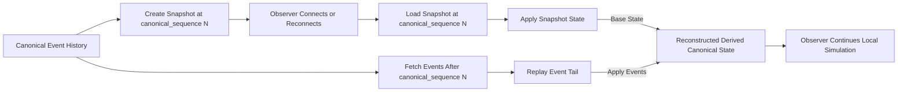

# CrypSA Snapshot and Replay

## Purpose

This diagram shows how CrypSA reconstructs current derived canonical state using:

* a snapshot
* the canonical event tail after that snapshot

It illustrates how CrypSA avoids replaying from genesis while keeping canonical event history as the source of truth.

---

## Diagram

---

## How to Read This

### 1. Canonical Event History Is the Source of Truth

Canonical event history defines what is real.

It is produced through validation by the validator and is the only authoritative record of the universe.

Snapshots do not replace history.

They are:

> cached reconstruction points

---

### 2. Snapshot Captures a Known State

A snapshot:

* is derived from canonical event history
* captures derived canonical state at a specific canonical_sequence
* is tied to a known position in history

This allows:

> Snapshot + event tail (events after the snapshot) = current derived canonical state

---

### 3. Observer Loads Snapshot

When an observer connects or reconnects, it can:

* load a snapshot
* avoid replaying from genesis

---

### 4. Replay Applies the Event Tail

The observer fetches and applies events after the snapshot position.

These events were previously accepted through validation and appended to canonical event history.

Replay applies them deterministically in canonical_sequence order to reconstruct current derived canonical state.

---

### 5. Simulation Continues

Once reconstructed:

* the observer has up-to-date derived canonical state
* local simulation resumes

---

## Key Insight

> Snapshots improve practicality.
> Canonical event history remains the source of truth.

And:

> all reconstructed state ultimately derives from events accepted through validation

---

## Relationship to Architecture

This diagram reflects:

* **Truth** → canonical event history (produced via validation)
* **Reconstruction** → replay + snapshot
* **Experience** → observer simulation

Snapshots are an optimization, not a source of truth.

---

## Relationship to Specs

This diagram maps to:

* `spec/CrypSA_Replay_Model.md`
* `spec/CrypSA_Snapshot_Model.md`
* `spec/CrypSA_Runtime_Spec_v0.1.md`

---

## One Sentence Summary

CrypSA uses snapshots as cached reconstruction points, allowing observers to load a known state and replay only the remaining events in canonical_sequence order, while canonical event history—produced through validation—remains the authoritative source of truth.
