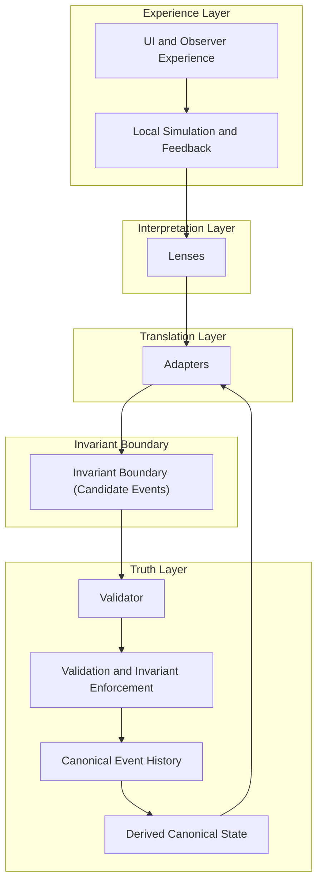

# CrypSA System Stack Diagram

## Purpose

This diagram illustrates the layered structure of a CrypSA system.

It shows how CrypSA separates:

* observer experience
* interpretation
* data translation
* canonical truth

This separation allows observers to simulate locally while canonical event history remains consistent.

---

## Diagram

---

## How to Read This

### Experience Layer

This layer includes:

* UI
* rendering
* input handling
* local simulation and feedback

It defines what the observer experiences.

This layer is:

* responsive
* immediate
* non-authoritative

---

### Interpretation Layer

Lenses:

* interpret data
* determine meaning
* define interaction meaning and relevance

They shape how the observer understands the world.

They do not define truth.

---

### Translation Layer

Adapters:

* reshape canonical and observer data
* prepare structured outputs

They isolate systems from raw runtime data.

They do not define truth or meaning.
Adapters do not interpret data.

---

### Invariant Boundary

The invariant boundary separates:

* local observer behavior
* canonical truth

When an interaction crosses this boundary:

* it becomes a candidate event
* it must be evaluated before becoming canonical

---

### Truth Layer

The truth layer includes:

* the **validator**, which evaluates candidate events
* validation and invariant enforcement
* canonical event history
* derived canonical state

The validator:

* accepts or rejects candidate events
* enforces invariants
* assigns `canonical_sequence` (authoritative ordering)
* appends accepted events to canonical event history

Canonical event history defines what is true.

Derived canonical state is reconstructed from canonical event history and is not independently authoritative.

The validator may run locally or remotely, but its role does not change.

---

## Key Insight

> CrypSA separates experience, interpretation, translation, and truth into distinct layers.

And critically:

> the invariant boundary controls what is allowed to cross into canonical truth, and validation determines what becomes canonical truth

---

## Relationship to Architecture

This diagram directly reflects:

* **Truth** → validation and canonical event history
* **Translation** → adapters
* **Interpretation** → lenses
* **Experience** → UI and simulation

---

## Why This Matters

This layered separation enables:

* responsive local simulation
* consistent shared reality
* modular system design
* scalable architecture

Because each layer has a clear responsibility, systems can evolve without collapsing boundaries.

---

## One Sentence Summary

CrypSA structures systems into experience, interpretation, translation, and truth layers, where the invariant boundary and validator ensure only validated events—ordered via `canonical_sequence`—become part of canonical event history.
