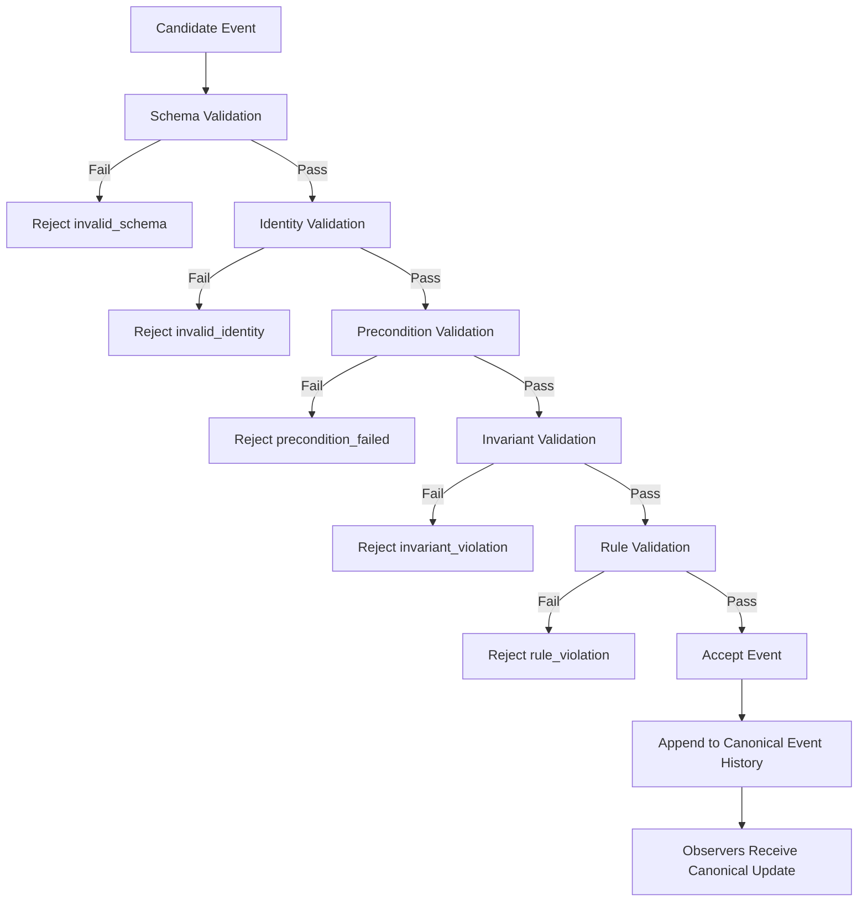

# CrypSA Validation Pipeline

## Purpose

This diagram shows how the server evaluates a candidate event before it becomes part of canonical history.

It represents the layered validation model used to determine whether an event is:

* accepted
* rejected

---

## Diagram

---

## How to Read This

### 1. Schema Validation

The server checks that the event is well-formed.

Examples:

* required fields exist
* payload structure is valid
* data types are correct

---

### 2. Identity Validation

The server verifies referenced identities.

Examples:

* actor exists
* target exists
* references are valid

---

### 3. Precondition Validation

The server checks that assumptions still hold.

Examples:

* tile is still empty
* ownership is unchanged
* required resources still exist

---

### 4. Invariant Validation

The server ensures canonical truth would remain valid.

Examples:

* no invariant violations
* no invalid transitions
* no impossible states

---

### 5. Rule Validation

The server applies event-specific rules.

Examples:

* placement rules
* upgrade constraints
* cost validation

---

## Key Insight

> Validation is layered.
> Failure at any stage prevents canonicalization.

---

## Relationship to Architecture

This diagram reflects the **truth layer**:

* validation
* invariant enforcement
* canonical event acceptance

---

## Relationship to Specs

This diagram maps to:

* `spec/CrypSA_Validation_Model.md`
* `spec/CrypSA_Runtime_Spec_v0.1.md`

---

## One Sentence Summary

A candidate event must pass schema, identity, precondition, invariant, and rule validation before it is accepted and recorded in canonical event history.
