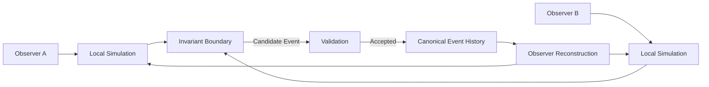

# Traditional Multiplayer vs CrypSA Architecture

---

“Terminology in this document may not match current CrypSA definitions.
Refer to the Terminology Primer for authoritative meaning.”

---

> Exploratory note: This document represents early conceptual framing.
>
> For the current CrypSA model, refer to:
>
> * `../../CrypSA_Why_It_Exists.md`
> * `../../CrypSA_Where_It_Fits.md`
> * `../../architecture/`
> * `../../spec/`

---

## Purpose

This document compares traditional multiplayer architecture with CrypSA.

The key difference:

> Traditional systems synchronize world state
> CrypSA synchronizes validated canonical events

---

## Traditional Multiplayer Model

### Characteristics

Traditional systems:

* centralize simulation on the server
* synchronize full mutable world state
* require continuous server operation
* tightly couple world existence to server infrastructure

If the server disappears:

> the world typically disappears with it

---

## CrypSA Model

---

## Core Difference

### Traditional Model

> The server simulates the world

* server computes and maintains world state
* clients send inputs and receive updates
* server holds authoritative state

---

### CrypSA Model

> Observers simulate locally, and a validator determines what becomes real

* observers simulate experience locally
* a **validator** evaluates candidate events
* accepted events extend canonical event history
* canonical event history defines shared truth

The validator is responsible for:

* validating events
* enforcing invariants
* maintaining canonical event history

> The validator is not a simulation engine

---

## Key Architectural Differences

| Traditional Multiplayer     | CrypSA                                   |
| --------------------------- | ---------------------------------------- |
| Server runs simulation      | Observers simulate locally               |
| State synchronization       | Event synchronization                    |
| Server computes world state | Validator determines canonical truth     |
| World tied to server uptime | World defined by canonical event history |
| Continuous state mutation   | Discrete validated state transitions     |
| Limited replayability       | Deterministic reconstruction via replay  |

---

## Implications

This architectural shift enables:

* distributed simulation
* reconstructable worlds
* event-driven persistence
* reduced centralized simulation load
* preservation-friendly universe design

CrypSA allows persistent universes to evolve through canonical event history rather than continuous centralized simulation.

---

## Key Insight

> Traditional systems synchronize what the world *is*
> CrypSA synchronizes what *happened*

---

## Summary

Traditional multiplayer architectures rely on centralized simulation and continuous state synchronization.

CrypSA replaces this with:

* local observer simulation
* validation-based authority
* canonical event history as the source of truth

---

## One Sentence Summary

Traditional multiplayer systems synchronize world state through server simulation, while CrypSA synchronizes validated canonical events and allows observers to reconstruct the world locally.
