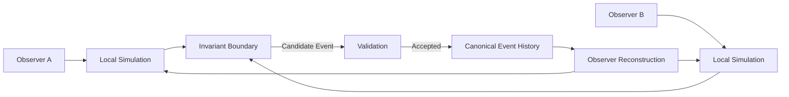

# Traditional Multiplayer vs CrypSA Architecture

> Exploratory note: This document represents early conceptual framing.
>
> For the current CrypSA model, refer to:
>
> * `../../CrypSA_Why_It_Exists.md`
> * `../../CrypSA_Where_It_Fits.md`
> * `../../architecture/`
> * `../../spec/`

---

## Purpose

This document compares traditional multiplayer architecture with CrypSA.

The key difference:

> Traditional systems synchronize world state
> CrypSA synchronizes validated canonical events

---

## Traditional Multiplayer Model

### Characteristics

Traditional systems:

* centralize simulation on the server
* synchronize full world state
* require continuous server operation
* tightly couple world existence to server uptime

If the server disappears, the world typically disappears.

---

## CrypSA Model

---

## Core Difference

### Traditional Model

> Server simulates the world

* server computes state
* clients receive updates
* server is the source of truth

---

### CrypSA Model

> Observers simulate locally

* observers simulate experience
* server validates canonical changes
* canonical event history defines truth

The server is primarily responsible for:

* validating events
* enforcing invariants
* maintaining canonical event history

---

## Key Architectural Differences

| Traditional Multiplayer     | CrypSA                                |
| --------------------------- | ------------------------------------- |
| Server runs simulation      | Observers simulate locally            |
| State synchronization       | Event synchronization                 |
| Server computes world       | Server validates truth                |
| World tied to server uptime | World defined by event history        |
| Limited replayability       | Deterministic reconstruction possible |

---

## Implications

This architectural shift enables:

* distributed simulation
* reconstructable worlds
* event-driven persistence
* reduced server simulation load
* preservation-friendly universe design

CrypSA allows persistent universes to evolve through canonical event history rather than continuous centralized simulation.

---

## One Sentence Summary

Traditional multiplayer systems synchronize world state through server simulation, while CrypSA synchronizes validated canonical events and allows observers to reconstruct the world locally.
