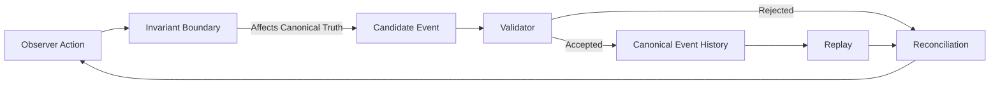

# CrypSA Minimal Runtime Walkthrough

## Purpose

This document shows the smallest practical end-to-end runtime flow of a CrypSA system.

It exists to make the architecture concrete.

This is not a full implementation guide.

It is a walkthrough of the minimum moving parts required to demonstrate the CrypSA runtime model in practice.

The goal is to show:

* what components exist
* what each component does
* how a simple interaction flows through the system
* what a minimal implementation must prove

For authoritative runtime behavior, refer to:

* `../spec/`

For the authoritative conceptual flow of the system, refer to:

* `../architecture/CrypSA_Runtime_Model.md`

For how this runtime design affects infrastructure, see:

→ `../architecture/CrypSA_Infrastructure_Implications.md`

---

## 📜 Authority Level

This document is implementation guidance.

It does not define runtime behavior.

It does not override the architecture or specification.

If there is any conflict:

* `/spec` defines behavior
* `/architecture` defines structure and conceptual flow
* this document illustrates one minimal practical implementation path

---

## What This Walkthrough Is

This walkthrough describes the smallest useful CrypSA runtime that proves:

* observers can perform actions locally
* actions that affect canonical truth become candidate events
* a validator determines whether those candidate events become canonical
* accepted events are appended to canonical event history
* observers replay canonical event history
* observers reconcile local state against canonical truth

---

## What This Walkthrough Is Not

This walkthrough is not:

* a production deployment guide
* a required transport design
* a required programming model
* a complete multiplayer framework
* a performance guide

It is a minimal proof path.

---

## Minimal Runtime Goal

A minimal CrypSA runtime should prove this sequence works end-to-end:

1. an observer performs an action  
2. the invariant boundary determines the action affects canonical truth  
3. a candidate event is created  
4. the candidate event is submitted to the validator  
5. the validator evaluates whether the candidate event becomes canonical using validation rules derived from applicable invariants  
6. if accepted, an event becomes canonical and is appended to canonical event history  
7. canonical events are made available to observers  
8. observers replay canonical event history  
9. observers reconcile local state with canonical event history  

If this works, the CrypSA runtime model is proven in executable form.

---

## Minimal Runtime Loop (Visual)



This loop repeats continuously.

> This loop replaces the need for a continuously running authoritative simulation.

---

## What This Replaces

A minimal CrypSA runtime does not require:

* a continuously running authoritative server simulation loop
* direct state synchronization between clients
* server-maintained mutable world state as the source of truth

Instead:

* validation defines canonical truth
* canonical event history replaces synchronized state
* observers perform local prediction

---

## Minimal Transport Assumption

A minimal runtime only requires two flows:

* observer → validator: submit candidate event
* validator → observers: make canonical events available

No direct state synchronization is required.

---

# Minimal Components

---

## 1. Observer

The observer is the local runtime instance responsible for:

* receiving input
* performing local prediction
* creating candidate events when the invariant boundary is crossed
* maintaining predicted state
* replaying canonical events
* reconciling local state with canonical truth

In a minimal implementation:

* one observer proves the loop
* two observers prove shared canonical truth (convergence to the same canonical state)

---

## 2. Validator

The validator is the authority that determines what becomes canonical.

It is responsible for:

* receiving candidate events
* evaluating them using validation rules derived from applicable invariants
* determining whether the candidate event becomes canonical
* assigning `canonical_sequence`
* appending accepted events to canonical event history
* making canonical events available to observers

The validator may run:

* locally
* remotely

The deployment does not matter.
The role does.

---

## 3. Canonical Event History

Canonical event history is the source of truth.

A minimal implementation only needs:

* append-only storage
* `canonical_sequence`
* ordered retrieval of accepted canonical events

This can be implemented as:

* an in-memory list
* a local file
* a simple database table

---

## 4. Replay Function

Replay derives canonical state from canonical event history.

A minimal implementation must prove:

* replay is deterministic
* replay produces identical results from identical history
* state can be rebuilt from canonical event history alone

---

## 5. Reconciliation Logic

The observer compares:

* predicted local state
* replayed canonical state

If they differ:

* local state yields to canonical truth

Minimal reconciliation:

* replace local values
* correct divergence
* continue simulation

---

# Minimal Example Scenario

## Example: Claim a Tile

A user attempts to claim a tile in a shared grid.

This works well because:

* clear conflict scope
* simple validation
* visible results
* proves authority and convergence

---

## Initial State

* tile `(2,3)` is unclaimed
* observer A sees it as open
* observer B sees it as open
* canonical event history contains no claim

---

## Action

Observer A performs:

```text
claim tile (2,3)
```

This crosses the invariant boundary into validation.

So a candidate event is created:

```json
{
  "event_type": "tile.claim_requested",
  "actor_id": "observer_a",
  "target_tile": [2, 3]
}
```

---

## Validator Evaluation

The validator evaluates the candidate event using validation rules derived from applicable invariants:

* structure is valid
* actor exists
* tile exists
* tile is not already claimed

### If accepted

```json
{
  "canonical_sequence": 17,
  "event_type": "tile.claimed",
  "actor_id": "observer_a",
  "target_tile": [2, 3]
}
```

Event becomes canonical and is appended.

### If rejected

* canonical event history does not change
* the rejection reason may be returned to the observer

---

## Availability

Canonical events are made available to observers.

Observers must:

* consume events
* order them by `canonical_sequence`

---

## Replay

Replay applies canonical events:

* tile `(2,3)` becomes claimed

---

## Reconciliation

Observers compare:

* predicted state
* canonical replayed state

If different:

* local state is corrected

All observers converge.

---

# Minimal Runtime Sequence

1. Observer performs action
2. Invariant boundary determines canonical impact
3. Candidate event is created
4. Event is submitted to validator
5. Validator evaluates using validation rules derived from applicable invariants
6. Canonical event is appended
7. Canonical event is made available
8. Replay derives canonical state
9. Observer reconciles

---

# Minimal Proof Checklist

## Core Truth Model

* candidate events ≠ canonical events
* validator defines canonical
* canonical event history is append-only
* canonical event history is the only source of truth

## Replay Model

* state derives from canonical event history
* replay is deterministic
* results are consistent

## Reconciliation Model

* local prediction allowed
* divergence corrected
* rejected events do not affect history

## Ordering Model

* events use `canonical_sequence`
* ordering is independent of delivery timing

---

# Suggested Minimal Runtime Architecture

```text
Observer
  ├── Input Handling
  ├── Local Prediction
  ├── Invariant Boundary Check
  ├── Candidate Event Creation
  ├── Replay Engine
  └── Reconciliation

Validator
  ├── Candidate Event Intake
  ├── Validation
  ├── canonical_sequence Assignment
  ├── Canonical Event History Append
  └── Canonical Event Availability

Shared
  └── Canonical Event History Storage
```

---

# Recommended First Implementation Scope

Keep it extremely small:

* one event type
* one invariant
* two observers
* no smoothing
* no production networking

Target:

```text
Two observers claim tiles on a shared grid
```

---

# What Must Be Visible

A demo must show:

* immediate local action
* candidate event creation
* validator decision
* canonical history changes only on acceptance
* replay updates state
* observers converge

---

# Why This Matters

This document proves:

> CrypSA is not just an idea — it is a minimal executable system.

It provides the bridge from:

* architecture → proof → implementation

---

# Relationship to Other Documents

* `../architecture/CrypSA_Runtime_Model.md`
* `../architecture/CrypSA_Boundary_Definitions.md`
* `../spec/`
* `minimal_validator/`
* `CrypSA_Local_First_Development_Approach.md`

---

# One Sentence Summary

A minimal CrypSA runtime proves that observers can act locally, candidate events can be validated into canonical event history, and canonical truth can be replayed and reconciled across observers using a small, well-defined set of components.
👉 This demonstrates that canonical truth can exist without a continuously running authoritative simulation.
