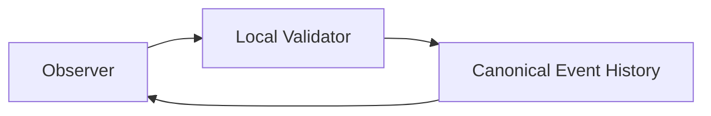
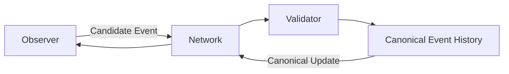

# CrypSA Minimal Validator v0.1

> Scope note: This document describes implementation strategy for a minimal validator proof step.
> For authoritative runtime behavior, refer to `../spec/`.

---

## Purpose

This document defines the smallest practical standalone validator that can prove CrypSA’s core runtime model.

The goal is not production readiness.

The goal is to prove that CrypSA functions as a real runtime system with:

* independent validation authority
* candidate event submission
* validation
* canonical event history
* canonical update distribution
* observer reconciliation support

This validator is a technical proof step between the teaching prototype and a full runtime system.

---

## Important Clarification

> The minimal validator may run locally and should be treated as a valid CrypSA deployment, not just a testing tool.

CrypSA defines validation as a **role**, not a machine.

This means:

* the validator can run locally alongside an observer
* the validator can run as a host
* the validator can run as a dedicated remote system

All three are valid CrypSA deployments.

The minimal validator represents the **simplest complete implementation of the validator role**.

It is not a reduced model — it is the full model in its smallest form.

---

## Validator Deployment (Minimal Context)

The minimal validator can run in different deployment configurations without changing system behavior.

---

### Local Deployment (Single Process / Offline)



In this configuration:

* observer and validator run in the same environment
* canonical event history is maintained locally
* no network is required

---

### Remote Deployment (Networked)



In this configuration:

* observers communicate with a remote validator
* canonical event history is shared across observers
* network latency and ordering must be handled

---

## Key Insight

> Deployment changes where validation runs, not how validation works.

---

## Quick Start — Local Validator (5 Steps)

This section describes the simplest way to run a CrypSA validator locally.

The goal is to prove the full runtime loop in a single process.

---

### Step 1 — Start Validator

Create a validator process that:

* initializes empty canonical event history
* initializes derived canonical state
* listens for candidate events

At this point:

```text
Canonical Event History = []
Derived State = initial (empty world)
```

---

### Step 2 — Connect Observer

Create a simple observer that:

* connects to the validator (or runs in same process)
* reconstructs state (initially empty)
* can submit candidate events

---

### Step 3 — Submit Candidate Event

Trigger a simple action from the observer:

Example:

```text
Place structure on tile_1
```

Observer creates and submits:

```json
{
  "event_id": "evt_001",
  "event_type": "place_structure",
  "actor_id": "player_A",
  "target_ids": ["tile_1"],
  "payload": {
    "structure_type": "basic_node"
  },
  "precondition_refs": {
    "tile_1_empty": true
  }
}
```

---

### Step 4 — Validate and Accept

Validator:

* checks schema
* verifies identity
* checks preconditions
* enforces invariants

If valid:

* assigns `server_sequence = 1`
* appends to canonical event history

---

### Step 5 — Broadcast and Reconcile

Validator sends canonical event to observer.

Observer:

* applies event via replay
* updates derived state
* clears any pending prediction

Final result:

```text
Canonical Event History = [event_1]
Derived State = updated world
```

---

## What This Proves

If these five steps work:

* validation is functioning
* canonical event history is working
* replay is working
* observer reconciliation is working

> This is a complete CrypSA runtime loop.

---

## Key Insight

> If it works locally, it works remotely.

Moving to a networked validator does not change:

* event structure
* validation logic
* replay behavior

Only transport changes.

---

## 1. Goals

CrypSA Minimal Validator v0.1 should prove:

1. observers can submit candidate events
2. the validator validates events
3. events are accepted or rejected
4. accepted events become canonical event history
5. derived state is updated by applying accepted events
6. observers receive canonical updates and reconcile
7. late join is supported via snapshot + event tail

---

## 2. Non-Goals

This validator does not attempt:

* scalability
* anti-cheat systems
* distributed shards
* combat systems
* physics validation
* branch merging
* cryptographic trust
* production persistence
* account systems

Keep it small.

---

## 3. Core Runtime Loop

```text
Observer Action
→ Candidate Event Submission
→ Validator Validation
→ Accept or Reject
→ Assign server_sequence
→ Append to Canonical Event History
→ Derived State Update
→ Observer Notification
→ Observer Reconciliation
```

If this loop works, the system works.

---

## 4. Validator Responsibility (Critical)

The validator:

* validates candidate events
* enforces invariants
* maintains canonical event history

The validator does **not**:

* simulate the world
* predict outcomes
* own UI or experience

> The validator controls truth, not simulation.

---

## 5. Recommended Scope

Keep the world extremely small:

* one tile grid
* simple player identity
* structure placement/destruction
* one resource
* one conflict scenario
* one reconnect path

---

## 6. Minimal Components

### Transport Layer

Handles:

* receiving candidate events
* sending results
* broadcasting canonical events

Recommended: WebSocket

---

### Event Intake

* parse event
* check required fields
* normalize structure

---

### Validation Pipeline

* schema
* identity
* preconditions
* invariants
* event rules

---

### Conflict Scope Resolver

* determine affected scope
* ensure atomic validation
* reject losing conflicts

---

### Canonical Event History

* append accepted events
* assign `server_sequence`
* act as source of truth

---

### Derived Canonical State Cache

* materialized view of state
* updated by applying accepted events
* used for validation + queries

---

### Snapshot Generator

* capture derived state at sequence
* support reconnect

---

### Session Manager

* track observers
* track last known sequence
* send updates

---

## 7. Minimal Data Flow

### Submission

```json
{
  "type": "candidate_event",
  "event": {
    "event_id": "evt_client_001",
    "event_type": "place_structure",
    "actor_id": "player_A",
    "target_ids": ["tile_42"],
    "payload": {
      "structure_type": "mining_station"
    },
    "client_time": 1234567890,
    "precondition_refs": {
      "tile_42_empty": true
    }
  }
}
```

---

### Acceptance

```json
{
  "type": "event_result",
  "source_event_id": "evt_client_001",
  "result": "accepted",
  "canonical_event_id": "canon_00014",
  "server_sequence": 14
}
```

---

### Rejection

```json
{
  "type": "event_result",
  "source_event_id": "evt_client_001",
  "result": "rejected",
  "reason": "conflict_lost"
}
```

---

### Canonical Update

```json
{
  "type": "canonical_event",
  "event": {
    "canonical_event_id": "canon_00014",
    "source_event_id": "evt_client_001",
    "server_sequence": 14,
    "event_type": "place_structure",
    "actor_id": "player_A",
    "target_ids": ["tile_42"],
    "payload": {
      "structure_type": "mining_station"
    },
    "accepted_at": 1234567900
  }
}
```

---

## 8. Idempotency Rule (Critical)

The validator must ensure:

* duplicate `event_id` submissions
* do not create duplicate canonical events

Each `event_id` must be processed exactly once.

---

## 9. Atomicity Requirement

Validation and acceptance must be atomic within conflict scope.

For v0.1:

* lock affected scope
* validate + accept atomically
* reject conflicts

---

## 10. Persistence

Minimal approach:

* append-only event file
* in-memory derived canonical state
* periodic snapshot files

---

## 11. Success Criteria

The validator is successful if:

* runs independently
* supports multiple observers
* validates correctly
* maintains canonical event history
* updates derived state correctly
* supports reconnect
* enforces idempotency

---

## 12. Development Order

1. validator process
2. event intake
3. canonical event history
4. derived state
5. validation
6. broadcasting
7. reconnect
8. conflict tests

---

## 13. Summary

This validator proves:

* observers do not define truth
* events must be validated
* canonical event history defines reality
* observers reconstruct from history

---

## One Sentence Summary

CrypSA Minimal Validator v0.1 proves that validated candidate events can be recorded as canonical event history and distributed to observers as shared truth.
