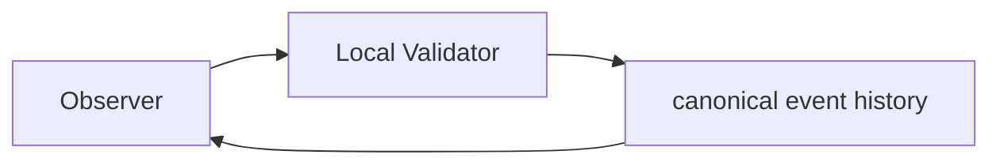
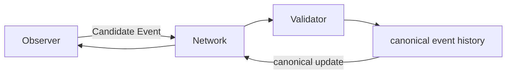

# CrypSA Minimal Validator v0.1

> This document outlines the smallest practical standalone validator for proving the CrypSA runtime model.
> For authoritative runtime behavior, refer to `../spec/`.

---

## Purpose

This document describes the smallest practical standalone validator that can prove CrypSA’s core runtime model.

The goal is not production readiness.

The goal is to prove that CrypSA functions as a real runtime system with:

* independent validation authority
* candidate event submission
* validation
* canonical event history
* canonical update distribution
* observer reconciliation support

This validator is a **technical proof step** between the teaching prototype and a full runtime system.

---

## Critical Positioning

> The minimal validator is a **valid CrypSA deployment**, not a testing tool.

CrypSA defines validation as a **role**, not a machine.

This means:

* the validator can run locally alongside an observer
* the validator can run as a host
* the validator can run as a dedicated remote system

The minimal validator is:

> the **smallest complete implementation of the validator role**

It is not a reduced model — it is the full model in its simplest form.

---

## Relationship to Local-First Development

This document assumes a **local-first development approach**.

You should:

1. run the validator locally
2. prove validation + replay
3. then move to remote deployment later

👉 See:

```
CrypSA_Local_First_Development_Approach.md
```

> First prove CrypSA locally. Then move the validator, not the architecture.

---

## Validator Deployment (Minimal Context)

The minimal validator supports multiple deployment configurations **without changing behavior**.

---

### Local Deployment (Recommended Starting Point)



In this configuration:

* observer and validator run in the same environment
* canonical event history is maintained locally
* no network is required

> This is a recommended starting point for implementations

---

### Remote Deployment (Later Stage)



In this configuration:

* observers communicate with a remote validator
* canonical event history is shared
* transport and latency must be handled

---

## Key Insight

> Deployment changes where validation runs, not how validation works.

---

## Quick Start — Local Validator (5 Steps)

This is the **core proof loop**.

---

### Step 1 — Start Validator

Create a validator that:

* initializes empty canonical event history
* initializes derived canonical state
* listens for candidate events

```text
canonical event history = []
Derived State = initial
```

---

### Step 2 — Connect Observer

Create an observer that:

* reconstructs state
* can submit candidate events
* optionally runs in the same process

---

### Step 3 — Submit Candidate Event

Example:

```json
{
  "event_id": "evt_001",
  "event_type": "place_structure",
  "actor_id": "player_A",
  "target_ids": ["tile_1"],
  "payload": {
    "structure_type": "basic_node"
  },
  "precondition_refs": {
    "tile_1_empty": true
  }
}
```

---

### Step 4 — Validate and Accept

Validator:

* checks schema
* verifies identity
* checks preconditions
* enforces invariants

If valid:

* assigns `canonical_sequence = 1`
* appends to canonical event history

---

### Step 5 — Broadcast and Reconcile

Validator sends canonical event.

Observer:

* replays event
* updates derived state
* clears prediction

```text
canonical event history = [event_1]
Derived State = updated
```

---

## What This Proves

If this loop works:

* validation is correct
* canonical event history works
* replay works
* reconciliation works

> This is a complete CrypSA runtime loop.

---

## Key Insight

> If it works locally, it will work remotely — provided transport does not define ordering and canonical_sequence remains authoritative.

---

## 1. Goals

The minimal validator should demonstrate:

1. observers submit candidate events
2. validator validates events
3. events are accepted or rejected
4. accepted events become canonical
5. derived state updates via replay
6. observers reconcile correctly
7. reconnect works via snapshot + event tail

---

## 2. Non-Goals

This validator intentionally excludes:

* scalability
* anti-cheat
* distributed shards
* complex physics
* combat systems
* branch merging
* cryptographic trust
* production persistence
* account systems

> Keep it small and focused.

---

## 3. Core Runtime Loop

```text
Observer Action
→ Candidate Event
→ Invariant Boundary
→ Validation
→ Accept or Reject
→ Assign canonical_sequence
→ Append to canonical event history
→ Replay
→ Notify Observers
→ Reconciliation
```

---

## 4. Validator Responsibility (Critical)

The validator:

* validates candidate events
* enforces invariants
* maintains canonical event history

The validator does **not**:

* simulate the world
* predict outcomes
* manage UI or experience

> The validator controls truth, not simulation.

---

## 5. Recommended Scope

Start extremely small:

* one tile grid
* one player
* structure placement
* one resource
* one conflict case
* one reconnect path

---

## 6. Minimal Components

### Transport Layer

Handles:

* receiving candidate events
* sending results
* broadcasting canonical events

(Local-first: this can be in-process)

---

### Event Intake

* parse event
* validate structure
* normalize

---

### Validation Pipeline

* schema
* identity
* preconditions
* invariants
* rules

---

### Conflict Resolver

* define conflict scope
* enforce atomic validation
* reject losing events

---

### Canonical Event History

* append-only
* assign `canonical_sequence`
* source of truth

---

### Derived State Cache

* materialized state
* updated via replay
* used for validation + queries

---

### Snapshot System

* capture state at sequence
* support reconnect

---

### Session Manager

* track observers
* track sequence
* deliver updates

---

## 7. Data Flow Examples

### Submission

```json
{
  "type": "candidate_event",
  "event": { ... }
}
```

---

### Acceptance

```json
{
  "type": "event_result",
  "result": "accepted",
  "canonical_sequence": 14
}
```

---

### Rejection

```json
{
  "type": "event_result",
  "result": "rejected",
  "reason": "conflict_lost"
}
```

---

### Canonical Update

```json
{
  "type": "canonical_event",
  "event": { ... }
}
```

---

## 8. Idempotency Rule (Critical)

* each event_id is expected to be processed exactly once
* duplicates must not create duplicate canonical events

If a duplicate `event_id` is received:

* the validator must return the original result (accepted or rejected)
* no new canonical event must be created
* canonical_sequence must not change

---

## 9. Atomicity Requirement

Within a conflict scope:

* validate + accept atomically
* reject conflicting events

---

## 10. Persistence

Minimal approach:

* append-only event log
* in-memory derived state
* periodic snapshots

---

## 11. Success Criteria

The validator can be considered complete when:

* runs independently
* supports multiple observers
* validates correctly
* maintains canonical history
* updates derived state
* supports reconnect
* enforces idempotency

---

## 12. Development Order

1. validator process
2. event intake
3. canonical event history
4. derived state
5. validation
6. broadcast
7. reconnect
8. conflict testing

---

## 13. Summary

This validator proves:

* observers do not define truth
* events must be validated
* canonical event history defines reality
* observers reconstruct via replay

---

## One Sentence Summary

CrypSA Minimal Validator v0.1 is the smallest complete implementation of the validator role, proving that validated events—ordered by canonical_sequence—form canonical event history and drive shared reality through deterministic replay.
