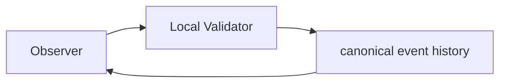

# CrypSA Minimal Validator v0.1

> This document outlines the smallest practical standalone validator for proving the CrypSA runtime model.
> For authoritative runtime behavior, refer to `../spec/`.

---

## Purpose

This document describes the smallest practical standalone validator that can prove CrypSA’s core runtime model.

The goal is not production readiness.

The goal is to prove that CrypSA functions as a real runtime system with:

* independent validation authority
* candidate event submission
* validation
* canonical event history
* canonical event distribution
* observer reconciliation support

This validator is a **technical proof step** between the teaching prototype and a full runtime system.

---

## Critical Positioning

> The minimal validator is a **valid CrypSA deployment**, not a testing tool.

CrypSA defines validation as a **role**, not a machine.

This means:

* the validator can run locally alongside an observer
* the validator can run as a host
* the validator can run as a dedicated remote system

The minimal validator is:

> the **smallest complete implementation of the validator role**

It is not a reduced model — it is the full model in its simplest form.

---

## Relationship to Local-First Development

This document assumes a **local-first development approach**.

You should:

1. run the validator locally  
2. prove validation + replay  
3. then move to remote deployment later  

👉 See:

```

CrypSA_Local_First_Development_Approach.md

```

> First prove CrypSA locally. Then move the validator, not the architecture.

---

## Validator Deployment (Minimal Context)

The minimal validator supports multiple deployment configurations **without changing behavior**.

---

### Local Deployment (Recommended Starting Point)



---

### Remote Deployment (Later Stage)


---

## Key Insight

> Deployment changes where validation runs, not how validation works.

---

## Quick Start — Local Validator (5 Steps)

---

### Step 1 — Start Validator

```text
canonical event history = []
derived canonical state = initial
```

---

### Step 2 — Connect Observer

Observer:

* reconstructs derived canonical state
* submits candidate events

---

### Step 3 — Submit Candidate Event

```json
{
  "event_id": "evt_001",
  "event_type": "place_structure",
  "actor_id": "player_A",
  "target_ids": ["tile_1"],
  "payload": {
    "structure_type": "basic_node"
  },
  "precondition_refs": {
    "tile_1_empty": true
  }
}
```

---

### Step 4 — Validation and Decision

The validator evaluates the candidate event using **validation rules derived from applicable invariants**:

* schema validation
* identity validation
* precondition validation
* validation rules derived from applicable invariants

Decision:

* If accepted, an event becomes canonical and is appended to canonical event history
* If rejected, the event does not become canonical and is not appended to canonical event history

---

### Step 5 — Broadcast and Reconcile

```text
canonical event history = [event_1]
derived canonical state = updated
```

---

## What This Proves

If this loop works:

* validation is correct
* canonical event history works
* replay works
* reconciliation works

---

## Key Insight

> If it works locally, it will work remotely — provided transport does not define ordering and canonical_sequence remains authoritative.

---

## 1. Goals

The minimal validator should demonstrate:

1. observers submit candidate events
2. validator validates events
3. events are accepted or rejected
4. If accepted, an event becomes canonical and is appended to canonical event history
5. derived canonical state updates via replay
6. observers reconcile correctly
7. reconnect works via snapshot + event tail

---

## 2. Non-Goals

* scalability
* anti-cheat
* distributed shards
* complex systems
* production persistence

---

## 3. Core Runtime Loop

```text
Observer Action
→ Candidate Event
→ Invariant Boundary
→ Validation (enforcement via validation rules derived from applicable invariants)
→ Decision
→ If accepted, an event becomes canonical and is appended to canonical event history
→ Assign canonical_sequence
→ Broadcast canonical event
→ Replay
→ Observer Reconciliation
```

---

## 4. Validator Responsibility (Critical)

The validator:

* validates candidate events
* enforces validation rules derived from applicable invariants
* maintains canonical event history

The validator does **not**:

* simulate the world
* predict outcomes
* manage UI

---

## 5. Recommended Scope

Start extremely small:

* one grid
* one player
* one action type
* one conflict

---

## 6. Minimal Components

### Validation Pipeline

* schema
* identity
* preconditions
* validation rules derived from applicable invariants

---

### Canonical Event History

* append-only
* assign `canonical_sequence`
* source of truth

---

### Derived Canonical State

* reconstructed via replay
* not authoritative

---

## 7. Minimal Data Structures

### Candidate Event

* `event_id`
* `event_type`
* `actor_id`
* `target_ids`
* `payload`
* `precondition_refs`
* optional `observer_time`

---

### Canonical Event

* candidate fields
* `canonical_event_id`
* `canonical_sequence`
* `accepted_at`

---

## 8. Idempotency Rule

* each `event_id` processed once
* duplicates return original result
* no duplicate canonical events

---

## 9. Atomicity Requirement

Within conflict scope:

* validation must be atomic
* conflicting events cannot both become canonical

---

## 10. Persistence

* append-only event log
* in-memory state
* optional snapshots

---

## 11. Success Criteria

The validator is complete when:

* runs independently
* validates correctly
* appends canonical events
* supports replay
* supports reconnect
* enforces idempotency

---

## 12. Development Order

1. validator
2. intake
3. history
4. state
5. validation
6. broadcast
7. reconnect

---

## 13. Summary

This validator proves:

* observers do not define truth
* validation determines what becomes canonical
* canonical event history defines reality
* state is reconstructed via replay

---

## One Sentence Summary

CrypSA Minimal Validator v0.1 is the smallest complete implementation of the validator role, proving that if accepted, an event becomes canonical and is appended to canonical event history, and shared reality is reconstructed via deterministic replay.
