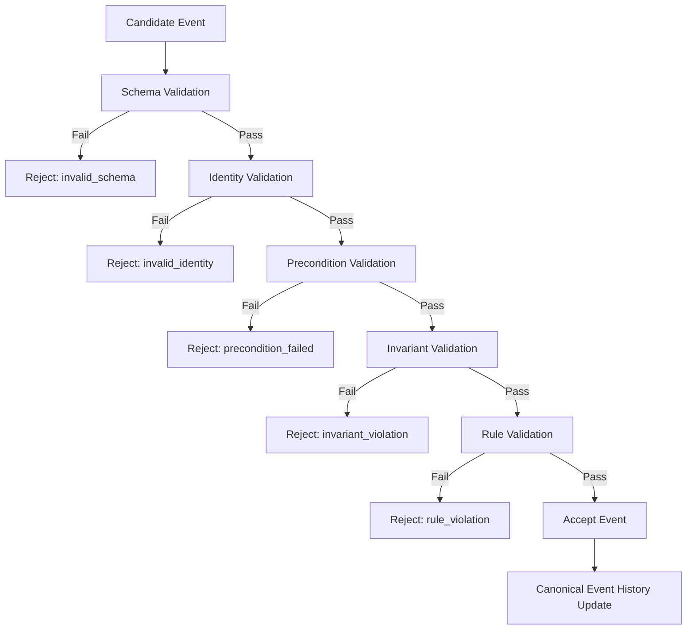

# 📄 CrypSA Runtime Spec v0.1

## Purpose

This document defines the minimal runtime behavior of a CrypSA system.

It specifies how:

* local observer actions become candidate events
* candidate events are validated
* canonical event history is updated
* observers reconcile to derived canonical state

This defines the minimum behavior required for CrypSA to be:

> technically reviewable and implementable

This is not a full production protocol.

---

## Visual Overview

For a high-level flow of the runtime:

👉 see `diagrams/CrypSA_Event_Flow.md`

---

## 1. Scope

This v0.1 runtime spec covers:

* observer action proposal
* candidate event structure
* validation of candidate events
* event acceptance and rejection
* canonical event recording
* canonical update distribution
* observer reconciliation
* snapshot-assisted reconstruction

This v0.1 spec does **not fully define**:

* combat adjudication
* advanced anti-cheat systems
* distributed shard coordination
* mergeable offline branches
* advanced partitioning strategies
* cryptographic trust proofs

---

## 2. Runtime Roles

### 2.1 Observer

A process that:

* reconstructs canonical objects locally
* simulates local experience
* proposes candidate events
* performs observer reconciliation

---

### 2.2 Validator

A process that:

* receives candidate events
* validates them
* enforces invariants
* records accepted canonical events
* distributes canonical updates

The validator does **not**:

* simulate the world
* predict outcomes
* control user experience

> The validator controls truth, not simulation.

The validator is defined as a **logical role** within the system.

Its deployment is not fixed:

* it may run locally within an observer environment
* it may run remotely as a separate system

The responsibilities of the validator do not change based on where it runs.

---

### 2.3 Server (Deployment Term)

In CrypSA, a **server** is a deployment of a validator that runs remotely.

Not all validators are servers, but all servers act as validators.

---

### 2.4 Persistence Model

The validator persists canonical event history as the source of truth.

Supporting runtime structures may include:

* snapshots
* indexes
* object identity registries
* genome references
* derived canonical state (materialized views)

These structures exist to enable:

* efficient replay
* fast lookup
* reconstruction
* recovery

They do **not define truth**.

> Truth is defined solely by canonical event history.

---

## 3. Core Runtime Principle

An observer action does **not directly modify canonical event history**.

Instead:

```text
Local Action
→ Candidate Event
→ Validation
→ Accept or Reject
→ Canonical Event History Update
→ Observer Reconciliation
```

Only accepted events become canonical.

---

### 3.1 Invariant Boundary

All candidate events originate from actions that cross the invariant boundary.

The invariant boundary defines the transition between:

* local simulation
* canonical validation

If an action does not cross the invariant boundary:

→ it remains local
→ it does not produce a candidate event

---

## 4. Event Classes

### 4.1 Local-Only Actions

Actions that do not affect canonical event history.

Examples:

* camera movement
* visual effects
* UI changes
* cosmetic previews

These never enter canonical event history.

---

### 4.2 Canonical Candidate Actions

Actions that may affect canonical event history.

Examples:

* mint object
* place structure
* destroy structure
* transfer ownership
* upgrade item
* consume resource

These must pass validation.

---

## 5. Candidate Event Structure

Each candidate event must contain:

```text
event_id
event_type
actor_id
target_ids
payload
client_time
precondition_refs
```

---

### 5.1 Field Definitions

**event_id**
Client-generated unique identifier.

Used for:

* idempotency
* retry safety
* reconciliation tracking

---

**event_type**
Defines the action.

---

**actor_id**
Canonical identity of acting entity.

---

**target_ids**
Canonical objects affected.

---

**payload**
Event-specific data describing the proposed state transition.

---

**client_time**
Client-local timestamp. Not authoritative.

---

**precondition_refs**
Explicit assumptions about canonical state.

---

### 5.2 Precondition Evaluation

* all preconditions must evaluate to `true`
* any failure → rejection

Preconditions must be:

* explicit
* deterministic
* verifiable

---

## 6. Event Ordering Model

CrypSA v0.1 uses:

> validator-defined canonical ordering with scoped conflict resolution

---

### 6.1 Canonical Order

* validator assigns `server_sequence`
* `server_sequence` defines authoritative ordering
* client order is not authoritative

> `server_sequence` is the canonical ordering assigned by the validator.
> The name is retained for compatibility with common terminology.

---

### 6.2 Conflict Scope

Conflicts are resolved within:

* object
* tile
* inventory slot
* ownership target

---

### 6.3 Conflict Resolution

* first valid accepted event wins
* later conflicting events are rejected

---

### 6.4 Atomic Validation Requirement

Validation must be atomic within the conflict scope, meaning:

* evaluation occurs against a consistent canonical context
* no interleaving of conflicting updates is allowed during validation

---

## 7. Validation Pipeline

Each candidate event passes through:



---

### 7.1 Determinism Requirement

All accepted events must produce deterministic results.

---

## 8. Validation Outcomes

### Accepted

* event recorded
* derived canonical state updated
* observers notified

---

### Rejected

* no canonical change
* rejection returned
* observer reconciles

---

### Rejection Codes

* invalid_schema
* invalid_identity
* precondition_failed
* invariant_violation
* rule_violation
* conflict_lost

---

#### conflict_lost

The event was valid at submission time but lost ordering within its conflict scope.

---

## 9. Canonical Event Recording

Canonical event history is append-only.

Each event includes:

* canonical_event_id
* source_event_id
* server_sequence
* accepted_at

---

### 9.1 Canonical Event Definition

A canonical event is an accepted candidate event that:

* has passed validation
* has been assigned `server_sequence`
* has been appended to canonical event history
* is immutable

---

### 9.2 Event Application

After a canonical event is appended:

* the event must be applied to derived canonical state
* the application must follow deterministic rules defined by the event type
* the result must match replay behavior

This ensures consistency between:

* live state
* replayed state

---

## 10. Derived Canonical State

Derived canonical state is:

* a materialized view of canonical event history
* not independently authoritative
* replaceable through replay

---

### 10.1 Derived State Rule

Derived canonical state must be a deterministic function of canonical event history.

At any time, it must be possible to:

* discard derived state
* reconstruct it solely from canonical event history

---

## 11. Snapshots

### Purpose

* reduce replay cost
* enable recovery

---

### Reconstruction Rule

> Snapshot + Event Tail → Derived Canonical State

---

## 12. Observer Reconciliation

Observers must:

* detect accepted/rejected events
* correct local state
* rebuild derived canonical state from canonical event history

---

## 13. Networking Assumptions

System must handle:

* delays
* out-of-order delivery
* retries
* duplicates

---

## 14. Idempotency Requirement

The system must ensure that duplicate `event_id` submissions do not create duplicate canonical events.

Each event must be processed exactly once.

---

## 15. Applicability

Best for:

* persistent worlds
* auditable systems

Not suited for:

* twitch combat
* physics-heavy simulation

---

## 16. v0.1 Non-Goals

Not defined:

* anti-cheat
* sharding
* cryptographic trust
* branch merging

---

## 17. Runtime Independence

The runtime does not require:

* continuous centralized simulation
* shared mutable state synchronization
* observer trust

All canonical changes must pass validation.

---

## 18. Summary

CrypSA runtime:

* observers simulate locally
* validator validates events
* canonical event history defines truth
* observers reconcile

---

## One Sentence Summary

CrypSA Runtime v0.1 defines how observer actions become validated canonical events and how derived canonical state emerges from canonical event history.
